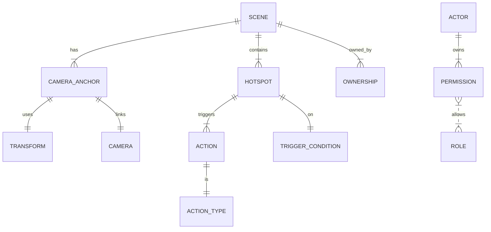

# P25 Experience — compact research (deep-research-P25)

Source-only compaction of `deep-research-P25.md`. No new facts, versions, or conclusions added.

## Thesis / direction

- P25 = domain-specific spatial experience editor: richer than plain 3D editor (semantics + guided flows), simpler than full game engine.
- Preserve: camera graph/sequence, preview mode, 2D map-based authoring, WebGL rendering, audio playback (author + visitor).
- Polish + deepen: hotspot/event system beyond simple triggers; camera-path authoring (timeline/curves); accessibility (keyboard, reduced motion); formalize serialization (glTF `extras` or JSON schema); mobile/WebXR perf.
- Defer / reject: full visual scripting / game engine, CMS, generic scripting, multi-user editing (unresolved/out-of-scope).

## Executive findings

- Camera: orbit/pan/zoom around POIs universal. `OrbitControls` ("allows the camera to orbit around a target"); `ArcRotateCamera` ("orbits around a target point"); Cinemachine dolly tracks + virtual cameras on timeline. Museum Editor graph ≈ three.js/Babylon; lacks path/timeline authoring UI.
- Hotspots: clickable anchors/colliders + linked actions standard. H5P "hotspots, quizzes, branching scenarios"; ThingLink "multimedia hotspots on images, video, 360 scenes, and 3D models"; A-Frame `<a-image>` + handlers; Krpano XML hotspots; Unity colliders; Yarn nodes; Matterport events. Museum Editor (`hotspots.ts`, camera-follow + audio only) rudimentary → adopt semantic event/action framework (any scene node, named triggers → play audio / navigate / show text).
- Actions: decouple what from how. Yarn Spinner (lines, options, jumps); H5P taxonomy; Unity Dialogue Interactable. Museum Editor only camera-focus + play-sound → add `SpeakText`, `ShowOverlay`, `HighlightObject`, `TeleportVisitor`, `PlayAnimation`, `SetVariable` (+ display text, change material, start video); multi-action per trigger like H5P.
- Journeys: predefined visitor paths standard (Cinemachine waypoint tracks; izi.Travel/VoiceMap GPS/location triggers; StoryMapJS/Scalar/Pageflow chapters). Museum Editor Camera Sequence exists, no rich UI → timed transitions + named tour stops ("Chapter"/"Stop"); linear tour first; branching/conditional later (FOLLOW-UP).
- Accessibility: none built-in today. Babylon extension (keyboard modes, high-contrast, screen-reader); Miris (`click-and-drag rotates, scroll zooms` + annotations/hotspots/exploded views) → keyboard/voice (WASD + arrows), ARIA on 2D overlays, hotspot labels, reduced-motion (jump vs lerp), narrator hook. Needs audit + testing.
- Authoring: WYSIWYG inspectors (A-Frame Inspector), timeline sequencers (Cinemachine), graph dialogue (Yarn/Twine), template hotspots (ThingLink). Polish camera list/hotspot panel; add Action Palette vocabulary; no full node-graph/visual-scripting.
- Data: glTF/GLB geometry + JSON metadata standard; 3D Tiles whole-scene; no narrative-metadata standard (glTF `extras` or sidecar JSON). Museum Editor custom project JSON presumed → hotspot as glTF node with `extras.action` or companion JSON; keep backward compat.
- Perf: 60 FPS target; culling/LOD/batching; progressive loading (coarse first); Draco; low-graphics mode. Unresolved until profiling (100k-tri / 50-anim spike).
- Preview: WYSIWYG required (Unity Game view; A-Frame Inspector; model-viewer/Sketchfab PBR). No published benchmarks → Editor-vs-runtime UX comparison needed.
- Ownership: rare in tour tools; no canonical WebVR solution → unresolved/deferred (owner vs viewer roles, accounts/branches).

## Camera & navigation

- Current (`spatial-sketch-editor`): `CameraGraph` + `CameraSequence`; `CameraGraph.ts` stores nodes; `CameraTransition` linear interpolation; Preview orbit-style follow edges/nodes; visitor keyboard/mobile orbit. No timeline sequencer or curve editor.
- External:
  - three.js `OrbitControls`: orbit/pan/zoom (mouse/keys); auto-rotate, damping, arrow keys. `three.js/examples/jsm/controls/OrbitControls.js` (MIT).
  - Babylon `ArcRotateCamera` (`alpha, beta, radius`): orbit target; inertia, zoom limits, auto-rotation. `@babylonjs/core/Cameras/arcRotateCamera.ts` (Apache 2.0).
  - A-Frame (on three.js): orbit or first-person components; `aframe-inspector` (`aframevr/aframe-inspector`) sets position/rotation.
  - Unity Cinemachine (proprietary, canonical pattern): Virtual Cameras, Dolly tracks, Timeline Shot clips (cuts/transitions); Tracked Dolly waypoints, smooth interp; editable paths.
  - Godot: Camera3D smoothing/interp; `PathFollow3D` on Bezier `Curve` (`Godot docs: PathFollow3D`); Path3D editor panel.
  - Miris model-viewer: orbit-only; "click-and-drag rotates, scroll zooms"; attrs-wired.
- Matrix (System | Type | Controls | Paths | Authoring UI | Ref):
  - Museum Editor | Orbit & Graph | drag, wheel, keys | Graph + sequences (custom) | node list, no curve editor | `src/Camera*`.
  - three.js | OrbitControls | orbit/pan/zoom mouse/keys | none (code-config) | self-managed component | `OrbitControls.js`.
  - Babylon.js | ArcRotateCamera | orbit alpha/beta, zoom radius | none (behaviors) | inspector/code, no path GUI | `arcRotateCamera.ts`.
  - A-Frame | fly-orbit, first-person | component-configurable | optional Cinematic | Inspector transforms | `aframe-inspector`.
  - Unity Cine. | Virtual Cameras | drag/WASD/scripts | Dolly + VirtualCamera on Timeline | timeline + Scene-view path editor | Cinemachine pkg.
  - Godot | Camera3D | orbit/zoom scripted | PathFollow3D on Curve | Path3D panel | PathFollow3D docs.
  - model-viewer | OrbitCamera | gestures/scroll orbit/pan | none | none (tag attrs) | N/A.
- Direction: KEEP/POLISH graph; expose arrows/touch explicitly (per [47]/[57]); add damping/inertia/auto-rotate; DEEPEN with spline drag / multi-camera transitions (Cinemachine-like); name nodes, edit alpha/beta/radius.
- Unresolved: parallel tracks vs conditional branches; WebGL anim perf; need timeline-slider prototype + device tests; camera-sequence edit ownership undefined.

## Hotspots & triggers

- Current: `Hotspot` / `Trigger` / `Action` modules; fixed zones, few built-ins (move-camera, play-sound); nav via UI/camera, not scene triggers.
- External:
  - H5P / ThingLink: 2D/360 hotspots; H5P primitives (hotspots, quizzes, branching); rich actions (text/image/video, link, popup); Web GUI/WYSIWYG.
  - Krpano: XML `<hotspot>` (angle, pitch, image, onclick); navigate/show-layer/call-action; VR-adjusted; ondenied; move/fade dynamics.
  - A-Frame: transparent entities + `cursor` (gaze) / `raycaster`; `<a-box>` + listeners; `three.js raycast + event emits`; VR gaze cursor. Ex: `aframe/examples/*.html`.
  - Unity/VR: collider + script; Event Trigger / custom (click/gaze/proximity); links to dialogue/anim; Yarn `DialogueInteractable`.
  - Twine/Yarn: passage links; Yarn Nodes (options/jumps) = logical hotspots; non-spatial branching model.
  - Miris: "higher-capability viewers add annotations, hotspots"; clickable info points expected.
- Matrix (System | Trigger | Actions | Authoring | Ref):
  - Museum Editor | Zones / Screen anchors | camera move, audio, custom scripts? | drag + select action | `src/Hotspot.ts`, `src/Trigger.ts`.
  - H5P | 2D image + 3D hotspots | text/image/video, branching | Web GUI dialog | N/A (H5P lib).
  - ThingLink | 2D/360 hotspots | multimedia popup, page links | online WYSIWYG | N/A (web service).
  - Krpano | XML `<hotspot>` | navigate pano, show layer, call action | XML config | krpano plugin docs.
  - A-Frame | entities + `cursor` | any HTML event (`onclick`) | HTML / Inspector | `aframe/examples/*.html`.
  - Unity | Colliders + Scripts | UnityEvents, audio, load scene, dialogue | Scene editor + Inspector | C# + UnityEvents.
  - Yarn/Ink | Dialogue Options | jump node, set var, call fn | text editor | `*.yarn`.
  - Miris | annotation overlays | AR placement, variants, hotspots | `model-viewer` attrs | HTML usage.
- Direction: ADD `Semantic Hotspot` + `TriggerCondition`; `OnInteract: [action list]` (`gotoLocation`, `showInfo`, `playAnimation`); multi-media per hotspot (text/image/3D); more trigger types (gaze, proximity, onExit); modular UnityEvents-style bus, no hardcoding; hotspot node can signal any actor.
- Unresolved: complex-chain authoring/naming UI open; many-trigger cost (distance/raycast) on mobile/WebXR needs prototype + UX tests; trigger create/modify ownership out-of-scope.

## Semantic actions

- Current: move-camera-to-node + play-audio only; no `Explain Exhibit` / `Change Lighting` / `Trigger Animation` abstractions; no trigger→arbitrary-change bus.
- External: Yarn (`Goto`/`Once`, set vars, custom commands, jumps); Twine SugarCube (`(click:...)[...]`, JS calls, story vars on entry) — content decoupled from engine; H5P branching (`if answer==X then do Y`; Question→Next slide, Show popup); Cinemachine/Timeline (play cutscene, switch cameras, timeline-marker fn calls); IFTTT trigger→effect-chain analogy.
- Direction: ADD modular Action system; `SpeakText`, `ShowOverlay`, `HighlightObject`, `TeleportVisitor`, `PlayAnimation`, `SetVariable` (+ display text, change material, start video); multi-action per trigger; KEEP camera/audio; scriptable primitives, not raw nav only.
- Unresolved: full set not finalized — start narrow (narration, highlight, navigation), expand later; data-driven JSON vs JS classes open; spike Unity-event-model vs simple dispatcher.

## Guided journeys & story flow

- Current: Camera Sequences script movement; whiteboard scene graph; no branching/time-scripting; manual play only.
- External: Cinemachine Timeline + `DollyTrack` waypoints (linear narrated tours); StoryMapJS/Scalar/Pageflow linear/branching chapters (scroll/time triggers); izi.Travel/VoiceMap location-triggered audio (GPS/hotspot advance); Ink/Yarn programmatic flow (loops, conditions); model-viewer camera-jump tours (often skipped).
- Direction: DEEPEN — timed transitions + named stops ("Chapter"/"Stop" + camera state + triggers, Yarn-node-inspired); linear timeline/list (moves + delay/narration) first; full state-machine scripting out-of-scope for Phase 5; branching = FOLLOW-UP.
- Unresolved: allow non-linear tours?; camera-timeline UX (Matinee/video-editor-like) needs design/test; tour-track narration ("on arrival play voiceover") needs prototype.

## Accessibility

- Current: none documented; no ARIA/assistive-mode code found.
- External: Babylon extension — object-centric tabbing, grid nav, high-contrast, color-blind filters, motion reduction, audio descriptions; `mesh.accessibility.label='...'`, `scene.accessibility.announce('...')`; A-Frame/model-viewer ARIA (`<model-viewer aria-label="...">`, DOM info, alt text); Babylon demo (WASD/arrows, voice, switch); Miris annotations + alt-text.
- Direction: POLISH + DEEPEN — full keyboard (arrows pan, Enter activates), ARIA on 2D overlays, hotspot/object labels (Babylon-style), reduced-motion (jump vs lerp), narrator track/event hook.
- Unresolved: full audit needed; prototype hotspot focus order + assistive-tech verify; voice / object-centric tabbing = product decision beyond Phase 5; may need testing/consultant.

## Authoring UX & vocabulary

- Current: visual/manual; 2D-plan camera/hotspot placement, property panels, sequence list; no timeline/scripting; UI terms (`Node`, `Edge`, `Hotspot`, `Camera Sequence`); no `NarrativeAction` / `TourStop` semantics.
- Patterns: Inspector direct-manipulation (A-Frame); playhead+tracks timeline (Unity/Godot keyframes); block&arrow graph (Yarn/Twine story map); wizard upload→click→dropdown (Roundme/Kuula); code/script (three.js/Babylon Playground); blocks (H5P/Scratch).
- Matrix (Pattern | Examples | P25 concept | Path):
  - WYSIWYG Scene Edit | A-Frame Inspector | CameraEntity, SceneNode (alias Master Node) | draggable objects + inspector panels.
  - Timeline Sequence | Unity Timeline | CameraSequence, AnimationClip | drag clips; split, cross-fade.
  - Graph/Flow Editor | Yarn Editor, NodeGraph | Dialogue/FlowChart | visual story/trigger scripting; possibly future.
  - Properties Panels | Unity/Godot Inspector | NodeProperties, HotspotProperties | forms set behavior.
  - Hotspot Wizard | ThingLink/H5P GUI | HotspotEntity, InfoBox | click location → info → action type.
  - Entity List | three.js Editor hierarchy | SceneGraph | tree/searchable node list (cameras, hotspots).
  - Drag-and-Drop Layout | Kuula VR | Portal/Edge | panorama click adds jump point.
- Direction: preserve whiteboard map/node layout; POLISH (Inspect-style side-by-side panels vs context menus; zoomable map; undo/redo); ADD vocabulary (`InfoPoint` hotspot, `CameraAnchor` node, `PlaySoundAction`/`MoveToAction`); ADD Hotspot Wizard; NO full visual-scripting/engine. Timeline/node-graph rework = FOLLOW-UP.
- Unresolved: owner/UX input on names/layout; multi-user editing out-of-scope; declarative UI vs JSON scripting open (plan: declarative UI only).

## Data model & serialization

- Current (presumed, unverified): custom JSON; TS classes `Project → Scenes → Nodes → Cameras → Hotspots → Actions`; project file holds graph, positions, hotspots. Verify via `src/models/Project.ts` + saved JSON.
- External: glTF/GLB hierarchy (nodes, transforms, meshes, materials) + `extras` custom metadata; `<model-viewer>` geometry/camera; hotspots as empty nodes + metadata (no tour-data standard); 3D Tiles/Cesium/Matterport whole-scene; KML Places + Tour (markers + anims); Roundme JSON (panorama URLs, hotspot coords, camera poses) / krpano XML ≈ JSON/XML configs; Unity/Godot scenes (binary/YAML + scripts/UI).
- Direction: DEEPEN via open standards where feasible; glTF for geometry/camera (in use); experience data as glTF `extras` (hotspot node + `extras.action`) or companion JSON; reuse glTF tooling; fallback JSON schema if rigid; POLISH = backward compat.
- Unresolved: `extras`-inline vs sidecar; action/condition schema; versioning (software version in data); survey glTF extension practices in design.
- Proposed ER (mermaid, verbatim relations):

Fig: Scenes hold CameraAnchors + Hotspots; Hotspot → TriggerCondition(s) + 1..n Actions (typed); ownership/permissions separate layer.

## Runtime performance

- Current: unknown; three.js/Babylon defaults assumed; no budgets/fallbacks; Preview large-scene handling unproven.
- Evidence: 60 FPS target; progressive loading (low-poly first, LumaDemo); bounding-volume culling (view-only); draw-call batching/merging; LODs + instancing; glTF/Draco fast loads (Miris); mobile/VR Oculus guideline 36 ms frame (16 ms/eye).
- Direction: FOLLOW-UP/DEEPEN — set metrics (60 fps desktop, 30 fps mobile); lazy-load distant objects; Draco; simplified Preview (hide heavy meshes); disable fancy shaders fallback.
- Spike fixture: complex scene (100k triangles, 50 animations) → measure; reveals opts.
- Unresolved: web vs standalone / mobile vs desktop targets unspecified; clarify devices; include reduced-motion in perf scope.

## Preview fidelity

- Current (assumed): Preview shows transitions + triggers via same engine → fidelity presumed high; lighting/physics deltas undocumented.
- Evidence: Unity Game view ≈ build (minus GI/post diffs); A-Frame Inspector ≈ page; `<model-viewer>` PBR lighting near-full; Sketchfab final shading; Miris model + basic lighting, no scripting.
- Direction: POLISH — same three.js/Babylon path both sides; match shadows/lighting/sound; clean-runtime Preview button; remove/note editor-only discrepancies; optional mobile/desktop emulation.
- Unresolved: no external fidelity benchmarks; Editor-vs-Publish UX comparison on key scenes; decide missing post-processing additions.

## Ownership & permissions

- Current: single-user files assumed; no authors/roles.
- Evidence: tour tools mostly single-user; engines/CMS have perms but no canonical WebVR-tour model; session guidelines silent.
- Direction: UNRESOLVED / out-of-scope for now; future probe (project owner vs viewer, accounts/branches).

## Recommendations / scope

- Keep: camera graph/sequence, preview, 2D map authoring, WebGL + audio both sides.
- Polish: camera list, hotspot panel, Inspect-style panels, zoomable map, undo/redo, preview parity.
- Add: key + gamepad controls; damping/inertia/auto-rotate; named camera params (alpha/beta/radius); Semantic Hotspots + TriggerConditions; `OnInteract` multi-action; `SpeakText`/`ShowOverlay`/`HighlightObject`/`TeleportVisitor`/`PlayAnimation`/`SetVariable`; Chapter/Stop linear tours; Hotspot Wizard; Action Palette; keyboard/ARIA/labels/reduced-motion; glTF-`extras`/JSON experience schema (backward-compat).
- Follow-up spikes: multi-camera parallel/branching; timeline-slider prototype + device tests; trigger-chain UX; many-trigger mobile/WebXR cost; JSON-vs-class event framework; Cinemachine-like timeline via GSAP/three.js; screen-reader HTML-overlay nav; glTF-extension survey; 100k-tri/50-anim perf; Editor-vs-Publish fidelity UX; branching tours.
- Reject/defer: full node-graph editor, visual scripting, full scripting/CMS, generic state-machine story logic, voice/object-centric tabbing (beyond P25), multi-user/CMS, permanent second geometry/nav/motion systems.

## Spikes & owner decisions

- Code audits: `CameraGraph`, `PreviewRenderer`, `Hotspot`/`Trigger` classes (physics, multi-trigger); camera-sequence save/load; `src/models/Project.ts` + JSON.
- Demos: A-Frame/three.js tour (`<a-gltf-model>` + cursor events) for hotspot feel.
- Tech spikes: GSAP/three.js timeline; ARIA-roles-on-3D via HTML overlay; Draco + lazy-load; 100k/50 perf harness.
- Owner decisions: P25 vocabulary (Triggers vs Actions; nodes vs scenes; `InfoPoint`/`CameraAnchor` ratify); target platforms + perf budgets (60 desktop / 30 mobile?); single-editor-only vs multi-user; Voice Control scope; timeline editor scope; glTF-inline vs sidecar + versioning.

## Source / reference index

- Code/paths: `src/Camera*`, `CameraGraph.ts`, `CameraGraph`, `CameraSequence`, `CameraTransition`, `src/Hotspot.ts`, `src/Trigger.ts`, `hotspots.ts`, `src/models/Project.ts`, `Hotspot`, `Trigger`, `Action`; `three.js/examples/jsm/controls/OrbitControls.js` (MIT); `@babylonjs/core/Cameras/arcRotateCamera.ts` (Apache 2.0); `aframe-inspector` (`aframevr/aframe-inspector`); `aframe/examples/*.html`; `*.yarn`; `src/...` P25 proposals (`CameraEntity`, `SceneNode`, `AnimationClip`, `Dialogue/FlowChart`, `NodeProperties`, `HotspotProperties`, `HotspotEntity`, `InfoBox`, `SceneGraph`, `Portal/Edge`, `PlaySoundAction`, `MoveToAction`, `SpeakText`, `ShowOverlay`, `HighlightObject`, `TeleportVisitor`, `PlayAnimation`, `SetVariable`).
- Components/attrs: `<a-image>`, `<a-box>`, `<a-gltf-model>`, `cursor`, `raycaster`, `<hotspot>` (angle, pitch, image, onclick), `<model-viewer>` (`aria-label`), `mesh.accessibility.label`, `scene.accessibility.announce`, `(click:...)[...]`, `extras` / `extras.action`, `DialogueInteractable`, `Goto`/`Once`, `OnInteract`, `gotoLocation`/`showInfo`/`playAnimation`.
- Tools/systems: three.js, Babylon.js, A-Frame, Unity/Cinemachine/Timeline, Godot, Miris model-viewer, model-viewer/Sketchfab, Cesium/3D Tiles/Matterport, KML/Google Earth, Roundme/Kuula, StoryMapJS/Scalar/Pageflow, izi.Travel/VoiceMap, Yarn Spinner/Twine (SugarCube)/Ink, H5P/ThingLink, Krpano, Oculus VR, LumaDemo, GSAP, IFTTT, Mirror.xyz, Scratch.
- Docs/notes cited: OrbitControls ("orbit around a target"); ArcRotateCamera ("orbits around a target point", "one of the most versatile"); Miris ("click-and-drag rotates, scroll zooms"; "higher-capability viewers add annotations, hotspots"); H5P ("hotspots, quizzes, branching scenarios"); ThingLink ("multimedia hotspots on images, video, 360 scenes, and 3D models"); Yarn (lines, options, jumps); H5P branching (`if answer==X then do Y`; Question→Next slide; Show popup); Oculus 36 ms (16 ms/eye); markers [47]/[57] for explicit camera controls. No resolvable URLs in source — see audit.

## Research inventory / loss audit

- Named items: all tools/systems, code paths, components, P25 concepts, and actions above retained member-level (no umbrella substitution; e.g. `polygon`-style collapse not applicable; `SpeakText`/`ShowOverlay`/`HighlightObject`/`TeleportVisitor`/`PlayAnimation`/`SetVariable` kept discrete; `grid/endpoint/midpoint`-style snap list N/A here).
- URLs: none present in source as resolvable links → NON-PORTABLE CITATIONS: all claims citing OrbitControls docs, ArcRotateCamera guide, Inspector repo, Babylon accessibility example, Miris glossary, H5P/ThingLink descriptions, Yarn docs, Cinemachine blog, Godot PathFollow3D docs, Oculus guidelines rely on textual handles only; no URLs invented.
- Quantitative: 60 FPS desktop, 30 FPS mobile proposal, 36 ms (16/eye), 100k triangles + 50 anims spike, six-system camera matrix, eight-row hotspot matrix, seven-row UX matrix, 10-relation ER diagram — all retained.
- Fixtures: ER mermaid verbatim; matrices row×col reconstructable; no wall-split-style numeric fixture in source (none invented).
- Rejections/deferrals: full scripting/CMS/engine, generic state-machine, voice/tabbing beyond P25, multi-user, second systems — retained.
- Caveats/unresolved: every section's Unresolved + spikes + owner decisions retained; uncertainty (presumed/assumed/unverified current-model claims) preserved as-is.
- Audit: [x] sections accounted for (exec, camera, hotspots, actions, journeys, a11y, UX, data, perf, preview, ownership, summary) [x] matrix dims retained [x] named projects/tools retained [x] links attached (textual; flagged non-portable) [x] quantities retained [x] fixtures/ER retained [x] enumerations member-level [x] protected tokens mapped [x] rejections retained [x] caveats + questions retained [x] no invented citations/conclusion changes.
