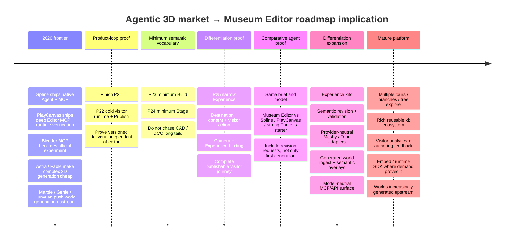

# Re-assessing Museum Editor’s Uniqueness in the Agentic 3D Market

## Executive summary

**Verdict: a mature Museum Editor can still be differentiated, but not for the reasons that looked strongest even a few months ago.** In September 2026, “AI-native 3D editor,” “MCP support,” “AI edits the same scene as the human,” “editable AI output,” “visual self-checking,” “browser 3D publishing,” and even “AI creates objects, materials, lights, cameras and interactions” are no longer credible uniqueness claims. Spline V2 now has a native agent that uses the editor’s own tools, takes screenshots, edits ordinary undoable/collaborative scene state, works across geometry/materials/lights/cameras/events/states, and exposes Spline through MCP. PlayCanvas exposes a similarly powerful MCP surface that can inspect and modify scene/assets/scripts/builds, create checkpoints, launch the application, inspect logs, capture the runtime and inject input for verification. citeturn12search4turn20search11turn20search0

This is the most important change relative to the earlier research. Your revised North Star correctly stopped claiming that semantic state or “agent-native” architecture is intrinsically a moat; it now says the advantage has to come from accumulated reusable behaviour across composition, revision, validation, runtime and delivery, and explicitly treats cheaper/more reliable production than bespoke generation as a hypothesis to measure. That change was correct. fileciteturn3file0L2-L2 The attached architecture/product audit reached the same underlying conclusion: dependable revision and delivery across repeated projects are more defensible than schema ownership itself, and Museum Editor eventually has to benchmark against a **strong reusable-code baseline**, not against an agent naïvely rebuilding Three.js from zero. fileciteturn0file0

At the same time, the external frontier has moved further toward your product. OpenAI’s current GPT-6 Astra examples include modelling a complete house in Blender and turning it into an Unreal Engine walkthrough; a Playco customer case connects Astra directly to Unity/Godot so it can edit scenes, play/test, validate and iterate, with Playco reporting 50% fewer manual fixes than the preceding model on its prototype workflow. Anthropic launched Fable 5.1 as its current flagship for coding/knowledge work, while community one-shot work shows Fable-class models compressing surprisingly elaborate procedural Three.js worlds into a single generated file. These are not all equivalent reliability evidence—OpenAI’s 3D examples are vendor demos/customer cases and the Fable worlds are community demonstrations—but they make “3D creation is difficult for AI” an untenable strategy. citeturn21search5turn21search3turn21search2turn14search1

World generation is simultaneously moving upstream. World Labs’ Marble has a production World API that accepts text, images and video, produces navigable worlds, shares them on the web and exports splats and GLB meshes; Google’s Genie 3 generates controllable photorealistic worlds in real time at 20–24 fps, although Project Genie remains an experimental research product; Tencent’s HY-World 2.0 and WorldClaw demonstrate open/research pipelines from prompts to navigable or large agentically composed 3D environments. This means a mature Museum Editor should assume that **the world itself may increasingly arrive already generated**. citeturn11search5turn11search1turn21search14turn11search12turn11search10

My strongest reassessment is therefore:

> **Museum Editor should not aim to be the best AI 3D editor. It should aim to be the best system for turning arbitrary spatial supply—drawn, imported, scanned, generated or agent-built—into a structured, revisable, reusable, validated and published visitor experience.**

That shifts the centre of gravity from **world creation** toward **experience orchestration**.

A mature product should ideally make this path much easier:

```text
prompt / brief
      ↓
drawn / imported / generated world
      ↓
semantic regions + anchors + assets
      ↓
stage
      ↓
direct camera + attention
      ↓
visitor journey + content + interaction
      ↓
validate
      ↓
publish
      ↓
observe
      ↓
revise
```

The hard strategic insight is that even **editability and validation are themselves commoditizing**. MUSE reports preservation-aware local editing with a 99.9% preservation rate and only 0.6% unintended changes on its reported editing split; SceneAssistant uses atomic scene operations plus rendered visual feedback; SceneTeract shows why deterministic geometric checks still matter by finding mismatches between VLM semantic confidence and physical feasibility; CinemaTraj composes semantic camera motions and optimizes them for collision avoidance. Museum Editor therefore cannot merely “have semantic operations, camera primitives and validators.” It needs to turn those into a coherent **production workflow, reusable library, runtime contract and visitor-experience domain** that generic tools do not specialize around. citeturn11academia38turn11academia36turn11academia37turn11academia39

My competitive assessment is:

**Spline is now the closest strategic competitor. PlayCanvas is the strongest infrastructure/developer competitor. Blender + frontier agents are the strongest power-user alternative. One-shot Three.js agents are the cost/flexibility baseline. World models are the strongest threat to Build/Stage. Meshy and Tripo should be partners, not competitors.**

The mature North Star is still broad enough: museums, exhibitions, architecture, historical walkthroughs, spatial portfolios, showrooms, education, interactive stories and related 3D-first experiences. I would preserve that breadth. fileciteturn3file0L2-L2 But I would sharpen what all of those have in common:

> **They are not just 3D scenes. They are designed visitor experiences through spatial content.**

That is the territory worth owning.

## Competitive landscape

The ratings below are my strategic assessment, not vendor claims. **Production** means a currently shipping commercial/official capability; **Official demo** means a first-party demonstration without broad reliability evidence; **Experimental** means an explicitly experimental product/interface; **Research** means evaluated research rather than a production product; **Community demo** means useful capability evidence but not a dependable benchmark.

| Product / project | Reliability | AI adoption | Workflow uniqueness | Reusability | Integration friendliness | Advantage vs one-shot generation | AI-proofability |
|---|---|---|---|---|---|---|---|
| **Museum Editor — mature target** | **Target, not current claim** | Model-neutral agent using same semantic behaviour as human | **Potentially high if centred on Spatial → Direction → Visitor Experience rather than generic 3D editing** | Potentially very high through rooms, staging, direction, experience kits and runtime | Provider-neutral canonical ingest; external models/worlds/DCC upstream | Must win on revision, reuse, validation and publish—not first generation | **Medium → High potential; unproven**. Current North Star correctly treats the economic advantage as a hypothesis. fileciteturn3file0L2-L2 |
| **Spline V2 / Omma** | **Production editor; Omma beta** | **Very high:** native Agent; same editor tools; screenshot inspection; MCP to external agents; agent can author custom code | Very broad 3D design, apps, games, event/state interactivity, code and web experiences | Strong: editable scene state, collaboration, community remixing | GLB/GLTF, web viewer, Code API, Three.js/R3F-oriented workflows, MCP | **Strong:** AI-created work stays editable and deployable rather than being throwaway code | **High. Closest threat.** Spline has independently converged on much of the agent-native thesis. citeturn12search4turn20search11turn20search7turn12search13turn12search3 |
| **PlayCanvas** | **Production** | **Very high:** MCP, vibe coding, Codex/Claude/Cursor support, runtime verification | General-purpose browser 3D apps/games, AR/VR/configurators rather than experience-specific authoring | Very strong: templates, assets, version control, collaboration, reusable engine | Open-source engine, npm, React/Web Components, glTF/USDZ, WebGPU, splats | **Very strong:** agent can modify real project, checkpoint, launch, screenshot, read logs and inject controls | **Very high.** Generic engine breadth + agent tooling compounds as models improve. citeturn12search0turn12search1turn20search0 |
| **Verge3D** | **Production** | Native AI is not prominent in the first-party product material reviewed | Strong DCC→interactive-web workflow; 300+ Puzzles; configurators, e-learning, shops, AR/VR, games | Strong templates/Puzzles and cross-project reuse | Exceptionally strong Blender/3ds Max/Maya integration, WordPress/WooCommerce, SCORM, JS | Strong for teams already living in DCC tools because web behaviour and deployment are reusable | **Medium–High.** Its DCC bridge is durable, though agents may increasingly automate the same workflow. citeturn13search3turn13search7turn13search18 |
| **Vectary** | **Production** | AI image→3D integrated into editor | No-code interactive product presentation, configurators, AR/VR | File cloning, collaboration, reusable projects | Browser import/edit/publish/embed workflow | Moderate–strong for product presentation because authoring + sharing are integrated | **Medium.** Strong workflow, but general models and broader tools can increasingly reproduce it. citeturn13search1turn13search5turn13search14 |
| **Shapespark** | **Production** | Little native AI emphasis in current first-party workflow | Extremely focused: architecture model → lighting/material → POIs/tour → browser walkthrough | **Good domain reuse:** it preserves visualization settings when source models update | Revit, SketchUp, 3ds Max plus FBX/COLLADA/OBJ; one-click web share/embed | Strong in archviz because it avoids building a runtime and lighting pipeline repeatedly | **Medium.** Narrow specialization helps, but generated worlds and agentic DCC threaten manual parts. citeturn12search2 |
| **Meshy** | **Production** | **Very high:** proprietary Meshy models, conversational 3D Agent, REST API, MCP; current API supports generation, remesh/retexture/rig/animation | Asset generation, not spatial-experience authoring | Assets reusable; workflow reuse mainly at asset-processing level | **Excellent:** GLB/FBX/OBJ/STL/USDZ/3MF, REST and MCP | Meshy *is* one-shot/iterative asset supply; it removes a reason for Museum Editor to own mesh generation | **Medium.** Valuable upstream supplier, but model-generation quality is heavily commoditized. citeturn20search1turn20search6turn20search5 |
| **Tripo** | **Production** | High: text/image/multi-image generation, texturing, processing, rigging/animation workflows; SDK/ComfyUI and MCP ecosystem | Asset-generation pipeline rather than experience system | Reusable generated assets and automated processing | Strong APIs/SDKs, ComfyUI, Blender-facing tooling and standard model workflows | Same conclusion as Meshy: supply is increasingly cheap and programmatic | **Medium.** Excellent integration candidate; weak reason to compete directly. citeturn5search15turn5search4turn5search2turn5search1 |
| **Blender + official MCP + frontier agent** | **Blender production; MCP experimental** | External model drives Blender Python API through MCP; Blender explicitly says its server itself contains no LLM | **Extremely broad DCC**: geometry, procedural systems, materials, animation, rendering and asset ecosystem | Extremely high through `.blend`, assets, Geometry Nodes, scripts, libraries | Python, huge format/tool ecosystem, MCP | **Very strong** once Astra/Fable-class agents can manipulate it: user gets real editable DCC state rather than generated bespoke web code | **Very high.** The ecosystem and accumulated operators improve agent usefulness as models improve. Do not compete head-on. citeturn6search0turn6search3turn6search8turn21search5 |
| **GPT-6 Astra / Claude Fable + Three.js starter** | **Models production/rolling out; individual 3D examples often demos** | The model *is* the agent; can code, use computers and tools | Essentially unlimited because it can generate custom software | Increasing rapidly through skills, starters, component libraries and model memory/context | Maximum code-level interoperability | **This is the one-shot baseline itself.** Astra already demonstrates Blender→UE5 and Playco engine editing; Fable-class one-shot Three.js demos are impressive | **Very high and improving.** This is why “saving tokens” alone cannot be a moat. citeturn21search5turn21search3turn21search2turn14search1 |
| **World Labs Marble / Google Genie / HY-World** | **Marble/API production; Genie experimental; Hunyuan mixed OSS/research** | Specialized world models rather than conventional editor agents | Prompt/image/video → navigable world; increasingly direct world creation | Currently more reusable as world/output than fine semantic authoring | Marble exports splats/GLB and has API; Hunyuan releases models/code; Genie is more closed research product | **Very strong at environment creation.** Can skip much of traditional Build/Stage | **High**, especially if semantic object editing, interactions and deployment continue improving. citeturn11search5turn11search1turn21search14turn11search12 |
| **SceneAssistant / MUSE / WorldClaw / Gizmo-class OSS** | **Research / early OSS** | Agent-native by design: atomic operations, visual feedback, memory, verification, MCP | Scene generation/editing rather than polished end-user product | Increasingly strong: structured state/commands and preservation-aware edits | Often Blender, Three.js, MCP, model/provider composition | Shows that “structured operations + visual critique + editable state” will itself become commonplace | **High directional threat, low current product maturity.** It tells you where infrastructure is heading. citeturn11academia36turn11academia38turn14search2turn14search3 |

### The competitor that changes the answer most: Spline

Spline V2 is now the clearest warning against making **“human and AI share one semantic editor”** the uniqueness claim. Its AI Agent builds and edits through Spline’s own editor commands; each edit goes into normal undo history, syncs to collaborators, and the human can immediately continue editing. Spline says the agent can manipulate objects, materials, lights, cameras, booleans, particles, cloners, lathes, sky, variables, events and states, and it takes screenshots as it works. Its MCP server lets Codex, Claude, Cursor and other MCP clients operate the live desktop editor. citeturn20search11turn12search4turn20search7

Spline has also moved beyond “3D scene designer.” Its Code tab stores HTML/CSS/JavaScript with the scene for custom UI and behaviours and lets the AI Agent author that code; its Viewer and Code APIs connect scenes to websites; Omma’s beta goes further by orchestrating code/image/3D agents to build interactive apps/games and publish them to live URLs. Thus **3D + interaction + web UI + AI + deployment** is not enough to distinguish Museum Editor. citeturn12search13turn12search9turn12search12turn12search3

The opening is that Spline is deliberately **general creative software**. Museum Editor can specialize around a much richer concept than “an event happens to an object”: **where the visitor is, what they are meant to notice, what content belongs at that spatial moment, how they navigate, how camera direction supports the journey, how branches/rejoin behave, and whether the whole experience is actually deliverable**. That specialization is an inference from Spline’s broad feature model and Museum Editor’s current North Star, not a claim that Spline cannot reproduce such projects. citeturn12search14turn12search13 fileciteturn3file0L2-L2

### PlayCanvas is the harder infrastructure benchmark

PlayCanvas already covers much of the eventual “agent authoring platform” idea at an engineering level. Its MCP documentation specifically recommends read-only inspection first, checkpoint creation before changes, observable outcome-oriented instructions, viewport capture, launching the actual application, reading runtime logs and state, injecting keyboard/mouse/touch input, and restoring checkpoints when a task fails. The agent can touch entities, components, scripts, assets, scenes, settings, templates, animation, builds and version-control state. citeturn20search0

Museum Editor therefore should **not** compete with PlayCanvas by becoming a smaller generic engine. Its advantage needs to be that the user or agent can say:

> “Create a six-stop architectural story. Reveal the atrium, let visitors inspect these three objects, show contextual information at each stop, provide an optional branch into the archive room, preserve reduced-motion behaviour, then publish.”

and the system resolves that request into domain-level project state **without requiring the user or agent to design the general application architecture**. That is the difference between a domain product and an engine.

### Community evidence says one-shot is a real baseline, but not yet a reliability benchmark

A useful Fable community repo claims a single prompt generated an entire procedural island as one roughly 75 KB `index.html`, including terrain, water, vegetation, animals and seasons. Crucially, its own author contrasts that one-shot artifact with a much larger iteratively engineered version and says the latter goes deeper on nearly every axis. That comparison is more strategically useful than the eye-candy alone: **one-shot captures extraordinary breadth; repeated engineering still buys depth and maintainability.** citeturn14search1

A separate browser reimplementation of WorldClaw claims one prompt can produce a live, walkable, editable Three.js world in a few minutes for roughly US$0.50 of fal.ai credits. Gizmo exposes a Three.js/Rapier engine, serialized worlds, CLI, screenshot workflow and MCP commands to coding agents. Both are early community OSS rather than mature products, but they demonstrate how cheaply an “agent-native 3D substrate” can itself be recreated. citeturn14search3turn14search2

Social/video evidence should be weighted much lower. A June X demo mirrored by Digg showed Fable 5 producing a working Swiss-lever watch movement in Three.js while visually checking its output; a September YouTube hands-on session summarized by AI/TLDR describes an Astra agent working for roughly 12.5 hours on a 3D world. These are valuable signs of the frontier but are **demo/anecdotal evidence, not completion-rate or production-cost benchmarks**. citeturn16search11turn16search4

Reddit evidence is similarly best treated as ecosystem signal. Current r/threejs threads show increasingly polished browser-native experiences, while Reddit’s own Devvit ecosystem now includes AI agents that routinely build and publish games into Reddit posts; neither establishes that an AI can reliably satisfy arbitrary Museum Editor-class briefs. citeturn18search5turn18search0

## Where a mature Museum Editor can still be unique

The strategic centre should move from **“structured 3D editor”** to **“structured spatial-experience system.”**

### Own visitor-experience semantics, not generic interactivity

Almost every major competitor can make objects react to events. Spline has events, states and arbitrary code; PlayCanvas has a general component/script engine; Verge3D has more than 300 visual Puzzles spanning application logic, e-commerce, media, physics and e-learning. Competing on generic `click → do something` breadth is a losing scope battle. citeturn12search13turn20search0turn13search3

Instead, Museum Editor’s Experience layer should provide **high-level visitor semantics**:

```text
World / Region
    ↓
Destination
    ↓
Stop / Beat
    ↓
Shot / Transition / Attention
    ↓
Content
    ↓
Event → Target → Action
    ↓
Branch / Rejoin / Free explore
    ↓
Completion / continuation
```

The difference is that these concepts understand each other. A “museum stop” is not an arbitrary object plus JavaScript. It knows its destination, camera or free-explore presentation, associated content, interaction target, accessibility behaviour and next/rejoin semantics. An agent can instantiate a known-good stop in one operation; a human can inspect and change each constituent normally.

This also makes your Camera investment strategically more useful. Camera automation itself is becoming commodity: CinemaTraj has an LLM compose atomic dolly/orbit/crane/pan/tilt/zoom/arc moves from a structured scene graph and optimize trajectories for collision avoidance, while OpenAI’s Blender example shows current frontier models authoring cameras. The opportunity is therefore not “Museum Editor knows how to make camera paths”; it is **camera direction as one participant in a larger visitor-experience grammar**. citeturn11academia39turn21search5

### Treat generated worlds as an input, not an existential threat

Your current North Star already allows imported spaces and explicitly says Build/Stage/Direct/Experience are complementary rather than a mandatory sequence. That becomes much more important given Marble, Genie, Hunyuan and agentically assembled worlds. fileciteturn3file0L2-L2 World Labs already exposes world generation programmatically and exports high-quality GLBs, collider meshes and splats for downstream use; its high-quality meshes are large—roughly 600k triangles with textures or around 1M vertices/triangles in another variant—making downstream normalization and web optimization an obvious integration role. citeturn11search5turn11search1turn11search7

I would therefore broaden the mature semantic model beyond only explicitly authored rooms. Keep `Room` as a valuable architectural primitive, but add a future concept such as:

```text
Semantic Spatial Overlay

Region
Surface
Anchor
Portal
Support surface
Subject
Destination
```

A generated Marble/Hunyuan/Blender environment could enter as a world asset and then acquire these lightweight semantics without reconstructing the whole mesh as `LayoutDocument` walls.

Conceptually:

```text
World Labs / Blender / imported GLB / splat
                ↓
        canonical world ingest
                ↓
       semantic spatial overlay
    Region / Surface / Anchor / POI
                ↓
      Stage + Camera + Experience
                ↓
         validation + publish
```

That makes world models **suppliers to Museum Editor rather than substitutes for it** whenever the customer needs a directed, content-rich, revisable web experience.

### Make revision a first-class product contract

“Editable AI output” is already table stakes. Spline’s agent edits the normal file and shares ordinary undo history; PlayCanvas provides checkpoints/version control around MCP changes; MUSE’s research results show that highly localized preservation-aware scene editing itself can be improved algorithmically. citeturn20search11turn20search0turn11academia38

The differentiation should instead be something closer to a **semantic revision contract**:

```text
request
"make Stop 4 darker,
replace the sculpture,
make the reveal slower,
do not change any other stop"

            ↓

planned affected state
Scene: lights 12, 14 + entity 88
Camera: connection 5
Experience: unchanged

            ↓

candidate
            ↓
domain validation
            ↓
semantic diff
            ↓
one atomic revision
            ↓
runtime validation
```

That is much more valuable to a production user than “the AI can edit the scene.”

A mature human/agent UI should be able to answer:

> What did this request change?  
> What did it intentionally preserve?  
> Which downstream references were affected?  
> Did any visitor path, content binding or camera destination break?  
> Can I restore the previous published revision?

General agents will become increasingly good at doing this themselves; the product advantage is that Museum Editor can make these properties **cheap and deterministic because the domain already knows what the project means**.

### Turn reuse into complete experience kits

A raw mesh is becoming abundant. A single preset is easy for a model to generate. The stronger reusable unit is a tested combination of semantics.

Examples:

```text
Gallery stop kit
├─ display wall / pedestal arrangement
├─ lighting setup
├─ subject anchor
├─ camera reveal
├─ info panel
├─ reach/click behaviour
├─ reduced-motion alternative
└─ validation rules
```

```text
Product reveal kit
├─ product placement
├─ lighting rig
├─ hero shot
├─ orbit / inspection shot
├─ feature hotspots
├─ specification content
├─ CTA
└─ mobile behaviour
```

```text
Architectural tour segment
├─ destination
├─ approach camera
├─ establishing shot
├─ optional free-explore zone
├─ contextual media
└─ rejoin point
```

This is more strategically valuable than accumulating hundreds of CAD commands. A strong model can customize a small number of composable kits far more effectively than it can benefit from a giant collection of narrow UI tools.

The one-shot ecosystem itself points in this direction. Three.js “skills” projects package performant setup, asset handling and common scene patterns specifically so agents no longer re-derive boilerplate; Gizmo packages a serialized runtime plus commands/MCP; Spline lets people remix community projects. Reuse is therefore becoming a key battlefield rather than a unique Museum Editor idea. Museum Editor’s version should specialize reuse at the **whole spatial-experience level**. citeturn14search12turn14search2turn12search3

### Own spatial-experience validation, not “validation” in general

PlayCanvas already proves that a generic editor can let an AI launch an application, inspect the viewport, read logs, query state and inject controls. WebMCP explicitly frames structured tools as a way to improve agent speed, reliability and precision, and Google’s WebMCP documentation requires evals to verify whether agents choose and execute tools correctly. Generic verification is becoming standard agent infrastructure. citeturn20search0turn21search1turn21search18

Museum Editor can differentiate by knowing **what a spatial visitor experience is supposed to satisfy**:

| Domain-specific check | Why it matters |
|---|---|
| Destination reachable | Visitor journey correctness |
| Tour branch can rejoin | Experience graph correctness |
| Camera transition intersects architecture | Spatial-direction correctness |
| Named subject is visible at attention beat | Direction/content correctness |
| Content references valid asset/entity | Experience integrity |
| Deleted entity still referenced by action | Semantic project integrity |
| Free-explore area has safe/reasonable bounds | Visitor behaviour |
| Reduced-motion alternative exists | Accessibility |
| Keyboard/touch path works | Delivery quality |
| Published asset closure complete | Runtime correctness |
| Declared project performance budget passes | Web delivery |
| External asset provenance/attribution complete | Publication safety |

SceneTeract is particularly relevant here: its paper reports systematic mismatches between VLM semantic confidence and actual physical/geometric feasibility even for strong models, supporting the value of deterministic spatial checks rather than trusting an agent’s self-assessment. citeturn11academia37

### Let published use create a feedback moat

One potential mature differentiator not emphasized enough in the current North Star is the **post-publish experience loop**.

A runtime that understands destinations, stops, branches, content and interactions can eventually observe anonymous product-level facts such as:

```text
visitor entered Stop A
visitor skipped branch B
visitor repeatedly backed out of transition C
content panel D was never opened
mobile users abandoned before Stop E
```

That can feed human or agent recommendations:

> “Most mobile visitors leave during this 14-second transition.”  
> “The secondary branch has an 8% completion rate.”  
> “This information card is rarely opened.”  
> “A shorter camera route would preserve all mandatory content.”

This is not something to build before the core experience model. But in a **mature polished product**, actual visitor-outcome data could become more defensible than another generation feature because it links authoring to real-world effectiveness. This is a strategic inference, not a claim that current competitors cannot implement analytics.

## Integration and non-competition strategy

The most resilient product architecture is one that benefits from every advance in external AI rather than fighting it.

| External system | Recommended relationship | What Museum Editor should consume | What not to build |
|---|---|---|---|
| **Meshy** | **Primary upstream asset adapter candidate** | Text/image-generated GLB, normalized size/origin, textures, remesh, rig/animation metadata; provenance | Proprietary generic text-to-mesh model. Meshy already exposes generation/post-processing through REST and MCP. citeturn20search6turn20search5 |
| **Tripo** | **Primary/alternative asset adapter** | Image/text/multi-image assets, optimized variants, rig/animation outputs | Parallel internal generation stack. Tripo already exposes APIs/SDK/ComfyUI-style workflow surfaces. citeturn5search15turn5search4turn5search2 |
| **Blender** | **Upstream DCC / repair / advanced authoring** | GLB/glTF and eventually metadata-friendly round trips where practical | Sculpting, retopo, UVs, general procedural modelling, animation workbench. Blender’s MCP direction makes it more—not less—valuable as an upstream tool. citeturn6search0turn6search3 |
| **World Labs Marble** | **World/environment provider** | World exports, GLB/collider, possibly splat representations, camera/source metadata | Foundation world model. Marble’s World API already makes world creation programmable. citeturn11search5turn11search1 |
| **Hunyuan / other open world models** | **Optional world-generation adapters** | World/mesh/GS representations after normalization | Internal world-generation research programme. citeturn11search12turn11search6 |
| **OpenAI / Anthropic / Google models** | **Replaceable authoring clients** | Semantic authoring operations, inspection, validation, visual critique | Proprietary general planner as a prerequisite. Current frontier models change too quickly to encode provider assumptions into project truth. citeturn21search5turn21search2turn21search14 |
| **MCP** | **Agent transport adapter** | Project inspection and semantic operations | MCP-specific domain design. Spline, PlayCanvas, Meshy and Blender all demonstrate why MCP is becoming transport/table stakes. citeturn20search7turn20search0turn20search6turn6search0 |
| **WebMCP** | **Future browser-local transport option** | Safe contextual actions where browser-native agent access helps | Making project semantics depend on a still-evolving browser API. As of September 2026 the Imperative API remains an origin-trial/intent-to-experiment technology. citeturn21search6turn21search1 |
| **Three.js ecosystem** | **Underlying ecosystem + export/integration surface** | Standard runtime concepts, GLTF tooling, developer embed/extension possibilities | Generic Three.js application builder as the core product. Agent skills already make generic Three.js generation cheaper. citeturn14search12turn14search5 |
| **Spline / PlayCanvas** | **Benchmark first; interoperability only on demand** | Standard assets/files if customers bring them | Chasing feature parity. Their breadth is a reason to specialize, not duplicate. citeturn12search4turn20search0 |

This suggests a strong boundary:

```text
UPSTREAM SUPPLY
Meshy / Tripo / Blender / Marble / future generators
                     ↓
              canonical ingest
                     ↓
          MUSEUM EDITOR PROJECT
          ├─ spatial semantics
          ├─ staging
          ├─ direction
          ├─ visitor experience
          ├─ reusable kits
          └─ validation
                     ↓
               visitor runtime
                     ↓
                  publish
```

The product should be deliberately agnostic about **how a chair, building or landscape was created** once it has enough canonical metadata to be useful.

That matters because provider capability is changing quickly. Meshy’s API, for example, added real-world auto-sizing and origin placement options and currently exposes Meshy-6/latest generation; World Labs has already expanded export and coordinate-system compatibility; external capability will continue changing faster than your project schema should. citeturn20search5turn11search0

### What not to compete on

A mature Museum Editor should still resist:

**Mesh topology / sculpting / UV / rig-authoring:** Blender and specialized AI+DCC workflows have a structural advantage. Blender’s experimental MCP interface explicitly gives external agents access to its enormous Python-authoring surface. citeturn6search0turn6search3

**Raw 3D generation:** Meshy, Tripo and increasingly general models/world models already provide it through APIs, SDKs and agent surfaces. citeturn20search6turn5search15turn11search5

**General-purpose browser games/apps:** PlayCanvas and generated Three.js applications occupy this territory with much greater programming freedom. citeturn12search0turn21search3

**Generic no-code interaction programming:** Verge3D’s 300+ Puzzles and Spline’s events/states/code illustrate how deep this rabbit hole becomes. Museum Editor should provide the behaviour vocabulary needed by spatial experiences and expose an extension boundary later, rather than trying to match a universal scripting system. citeturn13search3turn12search13

**Generic AI orchestration:** WebMCP, MCP clients and frontier agents increasingly supply the planner. The durable product surface should be the quality of the operations and project representation, not a proprietary chat loop. citeturn21search1turn21search2turn21search5

## Strategic primitives and roadmap implications

The ranking below assumes the mature product position proposed above. “Strategic value” means: does this primitive increase differentiation, reuse, agent leverage and cross-project value as models get better?

| Rank | Primitive / capability | Strategic value | Why |
|---|---|---:|---|
| **1** | **Experience Stop / Destination / Beat** | **5/5** | Converts geometry into a visitor-oriented unit tying place, direction and content together. This is closer to the product’s unique job than another modelling primitive. |
| **2** | **Experience Kit** | **5/5** | Reuses a complete tested combination of space/staging/camera/content/behaviour/validation across projects. Harder to replace with a single prompt because the value is accumulated operational knowledge. |
| **3** | **Semantic validation + publish contract** | **5/5** | Turns project semantics into dependable delivery. Particularly valuable while research still finds gaps between VLM confidence and physical feasibility. citeturn11academia37 |
| **4** | **Semantic revision / diff / checkpoint** | **5/5** | Makes AI iteration safe and inspectable. Generic agents are rapidly improving at preservation-aware edits, so productization must go beyond merely “AI can edit.” citeturn11academia38 |
| **5** | **Canonical asset/world ingest + provenance** | **5/5** | Lets every improvement in Meshy/Tripo/Blender/world models improve Museum Editor rather than threaten it. citeturn20search6turn11search5 |
| **6** | **Region / Surface / Anchor / Subject overlay** | **4.5/5** | Allows generated/imported worlds to participate in Experience semantics without reverse-engineering every world into walls and rooms. |
| **7** | **Tour / Branch / Rejoin / Cue semantics** | **4.5/5** | A spatial-experience-specific grammar above generic event/state systems. Especially useful to agents and reusable kits. |
| **8** | **Camera Shot / Transition / Attention binding** | **4/5** | Valuable when bound to subject/content/journey; camera generation by itself is increasingly automatable. citeturn11academia39turn21search5 |
| **9** | **Room / Opening / Numeric / Snap / Alignment** | **4/5** | Excellent semantic Build substrate and reusable precision; remains useful without requiring general CAD. |
| **10** | **Placement / Material / Lighting rig presets** | **3.5/5** | Necessary quality/reuse layer, but Spline/PlayCanvas/Blender and agents increasingly automate these operations. citeturn12search4turn20search0turn21search5 |
| **11** | **Generic event scripting** | **2.5/5** | Needed as an escape hatch eventually, but poor differentiation against Spline, PlayCanvas and Verge3D. citeturn12search13turn13search3 |
| **12** | **Stairs / railings / sweep / revolve / broad CAD tail** | **2/5** | Useful when demanded by real projects; weak reason to delay the full experience loop. |
| **13** | **Native generic text-to-mesh** | **1/5** | Meshy/Tripo and model providers already compete directly here and can be called programmatically. citeturn20search6turn5search15 |

This changes the interpretation of your current staged P23/P24 decision. The minimum Build and Stage sets still make sense because they make the substrate genuinely usable, but **the strategic compounding layer begins once Experience can compose them**. Your revised North Star already moves P25 after minimum useful P23/P24 rather than their long tails; the market evidence makes that sequencing even stronger. fileciteturn3file0L2-L2

A useful roadmap implication is:



### The crucial benchmark gate

The earlier audit recommended comparing Museum Editor with a strong reusable-code baseline. I would make the benchmark harder now: **also compare against Spline V2 and PlayCanvas MCP**, because they already embody much of the proposed agent-native workflow. fileciteturn0file0 citeturn20search11turn20search0

Use the same frontier model, same assets and same brief across four paths:

| Path | Question being tested |
|---|---|
| **Museum Editor** | Does domain structure actually reduce total work? |
| **Spline V2 Agent/MCP** | Does a mature general 3D editor already provide enough semantic/editable workflow? |
| **PlayCanvas MCP** | Does a general web-3D engine plus strong agent simply win on flexibility? |
| **Strong Three.js starter + agent** | Does cheap bespoke software remove the need for an authoring platform? |

Do not stop after:

> “Build a museum.”

Give all four the same revision suite:

```text
Move the central exhibit but preserve the tour.
Replace four assets with a new provider's models.
Turn Stop 3 into an optional branch.
Make the hero reveal slower without affecting later timing.
Change the lighting but preserve the artwork material appearance.
Add reduced-motion behaviour.
Remove one exhibit and repair every dependent reference.
Publish the previous version again.
Let a human manually make the final change.
```

That is where the product thesis should either become obvious or fail.

## Risks and metrics

### Principal strategic risks

| Risk | Severity | Why it matters | Response |
|---|---:|---|---|
| **Spline converges on Museum Editor's thesis** | **Very high** | Spline already has same-editor agent edits, screenshot feedback, MCP, interactivity, custom code and web publishing. citeturn12search4turn20search11turn12search13 | Do not chase generic editor parity. Own visitor-experience semantics, spatial direction, kits and domain validation. |
| **PlayCanvas makes general engine authoring easy enough** | **Very high** | Its agent can edit, checkpoint, run, inspect, test and verify the real application. citeturn20search0 | Be radically easier at a narrower class of spatial experiences. |
| **One-shot bespoke code becomes effectively free** | **High / existential** | Astra/Fable-class models and reusable Three.js skills continuously reduce custom-app cost. citeturn21search5turn14search1turn14search12 | Benchmark total revision/delivery effort. Pivot toward runtime/embed specialization if no material advantage appears. |
| **World models bypass Build/Stage** | **High** | Marble/Genie/HY-World reduce the need to author environments from primitives. citeturn11search5turn21search14turn11search12 | Make imported/generated worlds first-class and add semantic overlays. |
| **Validation commoditizes** | **Medium–High** | PlayCanvas already offers runtime verification and research systems increasingly integrate deterministic critics. citeturn20search0turn11academia37 | Specialize checks around visitor meaning and publish guarantees. |
| **Revision commoditizes** | **Medium–High** | MUSE already reports strong preservation-oriented agent editing results. citeturn11academia38 | Productize revision history, semantic diffs, atomicity and human review rather than claiming AI editing itself. |
| **CAD/DCC scope consumes roadmap** | **High** | Blender remains enormously broader and is becoming directly agent-operable. citeturn6search0turn6search8 | Keep CAD work limited to high-leverage spatial semantics. |
| **Template constraint tax** | **Medium** | Reuse can make work faster but also repetitive or hard to override. | Ensure kits instantiate normal editable project state; measure override work. |
| **Provider lock-in** | **Medium–High** | Mesh/world model versions change rapidly. Meshy's API, for example, has already moved generation versions and parameters. citeturn20search5 | Normalize at ingest and preserve provenance; project truth stays provider-neutral. |
| **“Agent-native” becomes marketing without evidence** | **High** | Spline, PlayCanvas, Meshy and Blender all now have MCP/agent stories. citeturn20search7turn20search0turn20search6turn6search0 | Treat agent support as table stakes and measure outcome economics. |

### Metrics that actually answer whether the product is winning

The attached audit's proposed metrics remain directionally right; I would tighten them to the following core dashboard. fileciteturn0file0

| Metric | Definition | Why it matters |
|---|---|---|
| **Accepted-publish effort** | Wall-clock time + human active minutes from brief to accepted live version | Measures the actual product outcome, not tool-call theatre |
| **Total accepted-publish cost** | Model tokens/calls + generation providers + compute + failed attempts + human intervention | Tests the “cheaper than bespoke” hypothesis directly |
| **Revision locality** | Requested changes completed while unrelated project state remains unchanged | Probably the single most important AI-era authoring metric |
| **Revision success rate** | Percentage of realistic revision tasks completed without manual repair | Separates impressive creation from dependable production |
| **Cold publish pass rate** | Fresh browser/device can load the declared published revision with all referenced assets and behaviours | Measures reusable runtime value |
| **Human continuation time** | Time for a human unfamiliar with the AI's process to make a specified change using the editor | Tests whether AI output is truly owned by the user |
| **Cross-project reuse leverage** | Difference in completion effort for a second project using existing kits/primitives versus first implementation | Tests whether the substrate actually compounds |
| **Experience integrity failures** | Broken targets, unreachable destinations, camera/architecture conflicts, missing content, runtime errors per revision | Tests semantic system value |
| **Provider portability** | Success and normalization quality when equivalent assets/worlds come from different providers | Tests whether integration strategy is real |
| **Visitor outcome** | Completion, branch use, content engagement, abandonment and device-specific failure on published experiences | Eventually connects authoring decisions to real usefulness |

Do **not** optimize primarily for “agent tool calls.” A single giant tool can reduce call count while hiding complexity. Do not optimize for “percentage generated by AI” either. The desired outcome is not maximal automation; it is **reliable ownership of the result**.

A particularly useful metric inspired by MUSE would be:

```text
Revision locality =
requested targets correctly changed
+
required dependent changes correctly made
-
unrelated state changed
```

MUSE's reported preservation results show that this type of evaluation is already technically meaningful in 3D research; Museum Editor can turn it into an actual product acceptance metric. citeturn11academia38

## Mature North Star recommendation

I would **keep the broad product category** in the current North Star. It is better than narrowing Museum Editor to exhibitions or showrooms. The existing outcome set—museums, exhibitions, architecture, historical walkthroughs, spatial portfolios, product showrooms, education, interactive stories and other 3D-first web experiences—is strategically useful because the common thread is a **visitor experiencing spatially organized content**, not a particular industry. fileciteturn3file0L2-L2

But I would sharpen the core positioning again as the competitive market has moved.

### Recommended mature thesis

> **Museum Editor is a model-agnostic platform for composing, directing, revising and publishing interactive spatial experiences.**
>
> A project may start from architecture built in the editor, imported DCC content, generated assets, scanned environments or AI-generated worlds. Museum Editor turns that spatial supply into an inspectable experience model: semantic regions and anchors, staged content, camera and attention direction, visitor navigation, contextual media and interactions, reusable experience kits, validation and a versioned web runtime.
>
> Humans and AI operate the same project behaviour. External models and providers remain replaceable creators and inputs. The product does not compete to generate every mesh, world or line of code; it owns the structured experience and its reliable revision and delivery.

That differs subtly but importantly from:

> “We have a semantic 3D project format AI can edit.”

Spline effectively has that now. citeturn20search11

It differs from:

> “AI can modify the editor over MCP.”

PlayCanvas, Spline, Meshy and Blender all demonstrate that this is rapidly becoming standard infrastructure. citeturn20search0turn20search7turn20search6turn6search0

It differs from:

> “We can create beautiful 3D from a prompt.”

Astra, Fable-class coding agents, Meshy, Tripo, Marble, Genie and Hunyuan make that an increasingly crowded layer. citeturn21search5turn21search2turn20search6turn5search15turn11search5turn21search14

The stronger claim is:

> **“Give Museum Editor any usable world. We turn it into an experience.”**

And the strongest eventual proof would be:

```text
Astra / Fable / future model
             +
   Meshy / Tripo / Marble / Blender
             ↓
      Museum Editor
             ↓
 structured visitor experience
             ↓
  human can take over instantly
             ↓
 validation catches regressions
             ↓
 one revision does not break five others
             ↓
 known runtime behaviour
             ↓
 publish
             ↓
 repeat on the next project
```

That is much more resilient to model progress because a better model improves **every input and every authoring client** while the product continues supplying the reusable experience layer.

It still is not perfectly “AI-proof.” Nothing here is. Spline could specialize, PlayCanvas could gain higher-level templates, world generators could add semantic objects/interactions/hosting, and future agents could reproduce much of your runtime automatically. The attached audit was right to assign low confidence to any durable moat claim. fileciteturn0file0

The defensibility therefore has to accumulate rather than be declared:

```text
specialized experience semantics
        +
excellent human authoring UX
        +
agent-operable deterministic behaviour
        +
tested experience kits
        +
provider-neutral integrations
        +
domain validators
        +
publish/runtime guarantees
        +
version/revision history
        +
eventually real visitor outcome data
```

That combination is much harder to replace than any individual feature.

**Net assessment:** assuming Museum Editor reaches its mature, polished North Star, I would rate its strategic position as **promising but only conditionally unique**. As a generic AI-native web-3D editor, it is already entering a crowded category led most directly by Spline and PlayCanvas. As a **model-neutral spatial-experience orchestration, revision and publishing system**, with generated/imported worlds as inputs and visitor journeys as its deepest semantic layer, it still has a credible and meaningfully differentiated destination. The highest-value roadmap decision is therefore not to add more AI features; it is to make **Experience + reusable cross-domain kits + semantic revision/validation** become deeper than what a general-purpose 3D editor naturally wants to provide.