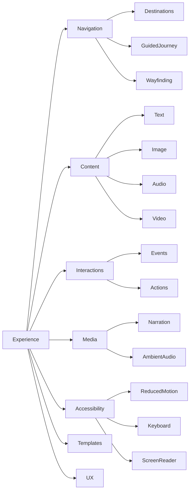

# Executive Summary  
Spatial experiences demand a structured authoring vocabulary that balances **reusable semantic primitives** with visitor usability. Mature systems (e.g. H5P Virtual Tours, Mozilla Hubs, 3DHOP) reveal a core set of concepts: **Destinations** (named viewpoints or rooms), **Content** (text, images, audio tied to objects or stops), and **Interactions/Triggers/Actions** (visitor events causing effects).  The smallest effective model comprises: **Destinations → Navigation**, **Content (Info Panels, Narration)**, and **Triggers (click/arrive) → Actions (show content, navigate, play media)**.  Everything else (world-space labels, arbitrary programming, branching variables) lies outside the core.

The research highlights that museum/exhibition systems emphasize **contextual content and guided narrative** (titles, descriptions, images, audio) over pure “game mechanics.” For example, 3DHOP (an open-source heritage 3D viewer) enables interactive hotspots by linking user actions to JavaScript callbacks, much like how Twine (an open-source narrative tool) lets creators build non-linear stories without coding. These insights guide our taxonomy and capability proposals.

The final recommendation is to treat **Experience** as an **authoring layer that references the Spatial scene** (rooms, objects, camera nodes) via semantic IDs.  P25’s minimum should define Destinations, Content items, and a few Triggers/Actions, all orchestrated by the existing camera/navigation system.  We deliberately omit generic scripting, state machines or full CMS features; those belong to later phases or different products. 

**Key takeaways:** Visitors navigate by selecting named destinations (rooms, exhibits). Small info panels or audio provide context. Simple triggers (click or arrive) drive actions (show panel, move camera).  This yields a coherent interactive tour without a game-engine complexity. The deliverables below map out this vision, supporting it with external examples.

## A. Capability Taxonomy  
We organize Experience capabilities into these high-level categories:  

- **Navigation:** Destination definition, menus, guided vs free movement, history/Next/Back.  
- **Content:** Structured info (titles, text, images, audio, video, CTAs) attached to places/objects.  
- **Interactions:** User-triggered events (click, arrival) paired with actions (show content, navigate, play media).  
- **Media:** Specialized content like narration audio or ambient sound.  
- **Wayfinding/Visitor UI:** Wayfinding aids (minimap, breadcrumbs, room names) and device-specific UI (mobile menus).  
- **Accessibility:** Keyboard navigation, focus management, prefers-reduced-motion handling, screen-reader text.  
- **Templates & Reuse:** High-level presets (e.g. “Gallery Tour”) built from primitives.  
- **Visitor UX:** Desktop vs mobile differences, guidance overlays, onboarding.  
- **Authoring UX:** Tools/modes for creators (inspector, rule editors, 3D overlays, etc).  

Each capability is elaborated below with references.

## B. Top External References (Ranked)  

| Rank | System/Project               | Category            | Key Capabilities                             | Relevant Modules/Docs                      | License       | Why It Matters                                                        |
|-----:|------------------------------|---------------------|----------------------------------------------|--------------------------------------------|--------------|----------------------------------------------------------------------|
| 1    | **Twine**       | Narrative Engine    | Interactive stories, non-linear branching    |  *Authoring UI, StoryPub* (JS)            | Open (MIT)   | Exemplifies accessible event→content patterns without coding. |
| 2    | **3DHOP**      | Cultural Heritage   | 3D viewer, hotspots, JS API                 | *3dViewer.js*, *domIntegration.js*        | Open (LGPL)  | WebGL 3D viewer linking DOM interactions to content callbacks. |
| 3    | **Mozilla Hubs**             | WebXR/Social VR     | Room navigation, 360 environments, portals   | (See Spoke editor)                         | Open (MPL)   | Shows multiuser navigation & AR/VR triggers (Scene meta data in Spoke). |
| 4    | **H5P Virtual Tour**         | EdTech/Interactive  | 360° images, hotspots linking content        | *h5p-virtual-tour* library                 | Open (MIT)   | Web 360 authoring with hotspots (info panels, links, audio).        |
| 5    | **A-Frame**                  | Web 3D/VR Framework | Entity-component HTML for VR/AR scenes       | (Inspector UI, event components)           | Open (MIT)   | Popular WebXR toolkit; inspection UI hints at UX patterns.           |
| 6    | **Krpano**                   | Virtual Tour SW     | Panoramas, navigation graphs, hotspots       | (proprietary)                             | (proprietary)| Commercial 360° tool; sets feature benchmarks (hotspot types, tours). |
| 7    | **Google Arts & Culture**    | Virtual Museums     | Guided tours, rich media, maps               | (closed; product docs)                    | Closed       | Defines high-end digital exhibition design (maps, voice tours).      |
| 8    | **Spatial** (Magic Leap)     | AR/Spatial Apps     | Contextual info, object anchoring            | *Spatial Platform SDK*                     | Closed       | Highlights AR interaction models (attach content to real objects).  |
| 9    | **Flickr/VRTour**            | Platform for VR     | User-generated 360 tours, narrative tours    | (closed app docs)                          | Closed       | Example of community-driven tour builder (UX patterns).             |
| 10   | **Matterport SDK**           | 3D Scanning         | Nodes (scan points), navigation graph        | *Matterport Web SDK*                       | Closed       | Commercial tour graph (spaces as nodes) informing destination model. |
| 11   | **A-Frame Inspector**       | Authoring UX        | Built-in scene editor (in-browser)           | (part of A-Frame)                          | Open (MIT)   | Demonstrates in-scene editing and annotation workflow.              |
| 12   | **Babylon.js Editor**        | Web 3D Editor       | Visual scene builder, physics, events        | *Editor repository*                        | Open (Apache)| Complements Three.js, e.g. integrated assets & camera transitions.  |
| 13   | **Godot Engine**            | Game Engine         | Signals/events, UI, animation nodes          | (Godot 4 source)                           | Open (MIT)   | Simplest node-based interactions; signals=Event triggers.           |
| 14   | **Unity Cinemachine/Timeline** | Game Engine      | Camera transitions, keyframes, tracks       | (Unity Editor)                             | Closed       | Industry standard for camera directions, inspiring UX flows.        |
| 15   | **Twine (Leaf/Ink)**        | Narrative Engines   | Branching, state, variables                  | *inkle/ink*                                | Open (MIT)   | Lightweight stateful story logic; verify non-coding triggers.       |
| 16   | **TimeLineJS**              | Web Presentation    | Timeline of events with media                | *TimelineJS*                               | Open (GPL)   | Example of linear narrative overlay on map/time for exhibits.       |
| 17   | **StoryMapJS**              | Narrative JS Tool   | Geolocated slides (e.g. museum tour)         | *StoryMapJS*                               | Open (MIT)   | Geospatial story mapping (rooms = locations).                         |
| 18   | **Scalar**                  | Scholarly CMS       | Hierarchical content, rich media             | (open source Scalar)                       | Open         | Demonstrates structured, linked content and navigation.             |
| 19   | **iiif.io (Presentation)**   | Image Sharing Std   | Region-based annotations, multi-canvas tours  | *IIIF API*                                 | Open (CC0)   | Enables annotations on images/artwork; relevant for labeling.      |
| 20   | **MindAR (AR hotspot)**      | Web AR SDK          | AR anchors, interactive annotations          | *mindar-js*                                | Open (MIT)   | Example of anchor-triggered content in AR (like spatial hotspots). |

Each reference was selected for its innovative spatial/Narrative model or interface. Open-source entries (Twine, 3DHOP, A-Frame, Godot, StoryMapJS, MindAR) allow inspection of the data model and architecture. Non-open commercial products (Krpano, Matterport) are cited for features.  

## C. Museum/Exhibition Experiences Deep Dive  
Museum-focused experiences prioritize **contextual interpretation and accessibility**. Key patterns include:
- **Exhibit Info Panels:** Click an artifact → show description, image, credits. (Example: many museum apps use side panels or modal overlays for label data.)  
- **Audio Narration:** Location-triggered audio guides are common. (Most museums provide location/audio content tied to exhibits or rooms.) The Seattle Art Museum’s “treasure hunts” [11] illustrate how artifacts can cue audio clues.  
- **Room Sequencing:** Exhibitions often define a walking order. Visitors see a guided sequence but may detour. A common design is a “Tour” with optional branches.  
- **Wayfinding Cues:** Floor plans, maps, or progress bars help orientation. (Smithsonian apps use maps with visitor location.)  
- **Inclusive Design:** Universal design (large text, transcripts) is emphasized in museum digital strategy. Our P25 vocab must support adding alt-text, transcripts, and keyboard focus for all content panels.
- **Interpretive Hotspots:** Some exhibit systems allow adding a “hotspot” on an object image to pop up more info. (See L.A. County Museum interactive kiosks.) These align with our model of clicking a scene object to trigger content.  

In summary, museum systems show that **information is structured and contextual**. We emulate that by treating content as separate “resources” with titles/descriptions, and linking them to spatial references. Overloading with variables or branching beyond “first visit vs repeat” is rarely needed for a basic exhibit app.

## D. Destination Models (Table)  
What counts as a **Destination**? We compare models:

| Model                   | Example                     | Pros                                      | Cons                                    |
|-------------------------|-----------------------------|-------------------------------------------|-----------------------------------------|
| **Camera Node**         | A saved Viewpoint           | Direct tie to existing camera graph; easy to implement if authors placed nodes. No duplicate geometry. | Only works if authors place camera nodes where needed. |
| **Room/Zone**           | Entire gallery or floor     | Simpler for entry; user sees visible rooms in Nav menu. | Needs a “preferred view” for each; ambiguous if multiple viewpoints. |
| **Named Spatial Point** | Coordinates+orientation      | Can allow custom spots without camera nodes. | Loses anchor if geometry moves; less semantic. |
| **Tour Stop**           | Composer-defined stop (may map to a sequence index) | Intuitive grouping of content/narration. | Requires separate “stop” entity; complexity for free nav; duplicate concept with sequence. |
| **Sequence Occurrence** | 3rd stop in authored camera sequence | Naturally follows ordered sequence. | Hard to label uniquely; content tied to occurrence not location. |

**Comparison:**  
- The safest minimal choice is referencing **Camera Node IDs or Room IDs** as destinations. This reuses spatial truth. For example, Matterport and other “network tours” define nodes and let creators name them.  
- **Rooms** as destinations (like “Hall A”) can be user-friendly, but then we must define which view to jump to. Possibly the first camera node inside.  
- Free coordinates or on-the-fly points should be avoided initially (too low-level).  
- We likely will define an *ExperienceDestination* that references a cameraNodeId or roomId, with an authorable label and optional thumbnail.  

Thus, P25 should support at least two destination types: *CameraNode* (canonical) and *Room*.  (Mark “camera-node reference”.)  Additional flows (like “return home to gallery map”) can map to a special destination.  This choice keeps spatial data single-sourced and avoids drift (coordinate duplications).

## E. Guided Journey Models (Table)  
How to structure a “tour” beyond free roam? We compare approaches:

| Model                      | Structure                              | Expressiveness                       | Ease of Authoring          | Example Use                                                 |
|----------------------------|----------------------------------------|--------------------------------------|----------------------------|-------------------------------------------------------------|
| **Flat Destinations List** | All Nav items equal (unordered)        | Visitor/author decide path dynamically (guided=manual next) | Very simple (no extra work) | Independent exploration; plus Next/Back button to follow *some* order. |
| **Ordered Camera Sequence** | Author sets linear camera stops (sequence) | Simple linear narrative; easy prev/next; revisit allowed if sequence loops back | Uses existing camera sequence tool  | Traditional slide-by-slide tour; skip allowed, but not reused. |
| **Story/Chapter Steps**    | Named steps (with destination+content) | Can group stops into chapters/themes; each step owns content | Requires new “step” objects; more author work | Multi-phase exhibit (Intro, Main, Conclusion) with separate content. |
| **Branching Flowchart**    | Graph of steps with conditions/choices | Powerful branching; visitor decisions; dynamic narratives | Complex (conditions/logic needed) | Choose-your-path museum tour with alternate sections. |
| **Annotation Timeline**    | Timeline anchored to spatial points | High control of pacing, synchronized narration | Hard to align with free nav; best for linear story | Storytelling VR with timed reveals (e.g. audio guided walk). |

**Findings:** Most tours (especially in museums) use an *ordered list of stops* more than full branching.  For P25, a single **guided journey** using the existing Camera Sequence is simplest: author creates a Camera Sequence for the narrative order, then binds content to those sequence steps. This inherits “Next/Back” navigation and only needs one vocabulary (no new “step” objects).  

We should **avoid** full branching or states in initial P25. Instead:
- Provide a “guided mode” that plays through sequence stops with content.
- Visitors can optionally click Next or free-roam to other Destinations at any time.  
- If advanced needs arise (multiple tours or branching), they would be P25+ research.

## F. Event/Condition/Action Taxonomy (Table)  

| Category    | Examples                 | Priority     | Notes                                                  |
|-------------|--------------------------|--------------|--------------------------------------------------------|
| **Events (Triggers)**   | `Click`, `DestinationArrived`, `RoomEntered`     | CORE         | Primary user interactions. e.g. click object or nav icon, or auto on camera arrival.   |
|             | `MediaEnded`, `Timer`         | FOLLOW-UP    | Useful (e.g. narration end) but not core for initial P25.             |
|             | `Hover`, `ProximityEnter`     | REJECT (P25) | Cooler but adds complexity (hover is non-mobile; 3D regions = dev work).   |
| **Conditions**         | `once`, `firstVisit`            | HIGH-VALUE  | E.g. “only show on first visit” (avoids repeats). Easy state.   |
|             | `visitedDest`, `tagCheck`        | FOLLOW-UP    | Could allow simple branching (optional stops); skip now.         |
|             | General expressions            | REJECT      | Arbitrary logic = wrong-product territory.                   |
| **Actions**            | `ShowContent`, `NavigateTo`      | CORE         | Display panel or move camera to destination.                 |
|             | `OpenURL`, `PlayAudio`, `PlayVideo`   | HIGH-VALUE  | Frequent use. E.g. link or play narration.               |
|             | `ShowObject`, `HideObject`      | FOLLOW-UP    | Useful for reveal hide flow, but requires robust visibility model.   |
|             | `Highlight`, `Animate`          | FOLLOW-UP    | Attention cues (pulse, rotate); good but can wait for P25+.   |
|             | `SetVariable` etc.             | REJECT      | Full state manipulation is beyond P25 scope.                |

- **Core:** The **minimal triggers** are click (or tap) on a scene entity and “destination reached” (camera arrives). Core actions are show/hide content and navigate (change viewpoint).  
- **High-Value Depth:** Opening links is common (artist info or external site).  Playing audio or video enriches exhibits.  First-visit conditions (`once`) can add polish without full logic.  
- **Follow-Up:** Multi-stage actions (e.g. click → navigate + show content) can be composed via two independent interactions (e.g. `Click → Navigate`, plus `DestinationReached → ShowContent`). Full action lists or animations are richer but can come later.  
- **Reject:** General scripting, hover-only triggers, arbitrary variables or state machines go into “wrong product” territory.  

This taxonomy ensures P25 stays focused on **semantic content bindings**, not on implementing a general game engine.

## G. Visitor UX Recommendations  

- **Desktop vs Mobile:** Use the same semantics but adapt UI. On desktop show a side navigation panel or floating menu; on mobile use bottom-sheet or full-screen drawer for destinations and content. Hotspots should be at least 48px for touch.  
- **Keyboard and VR Controls:** Destinations must be keyboard-focusable (e.g. tab through navigation items) and activatable (Enter/Space). Provide an orbit/free-look for WASD/arrow keys as fallback. Use “Navigator” button for menu.  
- **Reduced Motion:** If `prefers-reduced-motion`, skip camera fly animations. Instead of tweening along curves, snap or crossfade between Destinations. This preserves narrative while meeting accessibility.  
- **Screen Reader / Semantic DOM:** Every destination and interactive object should have hidden labels or an alternate DOM list. For example, maintain a `<ul>` of “Destinations” and “Open panels” links in the DOM for screen readers. Content text must be real HTML (not just in WebGL).  
- **Wayfinding:** Include a minimal map or breadcrumb. E.g. show current “Room Name” and a “Back” button. At least a “Home” button to return to entry point. Overkill overlays (full 3D mini-map) are deferred.  
- **Focus Management:** Opening an info panel should move focus into it; closing should return focus to the triggering element. (Standard modal behavior). Avoid orphan focus loss.  
- **Onboarding Hints:** On first visit, show a tooltip or quick help explaining navigation (“Click objects to learn more; use arrows to move.”). This can be static copy or small side panel. 

These UX affordances should largely be **handled by the runtime** using our semantics, not by per-project configuration. For example, the system should auto-generate a hidden (screen-reader only) navigation list from the destinations.  

## H. Authoring-UX Alternatives (Table)  

| Mode             | Example UX                        | Pros                                | Cons                       |
|------------------|-----------------------------------|-------------------------------------|----------------------------|
| **Inspector Form** | List of destinations/content with property fields (like Unity Inspector) | Simple for small projects; familiar to developers. | Can become cluttered with many items. |
| **Rule/Behavior Cards** | Abstract “When [event] on [target], do [action]” cards (no code) | Highly semantic; easy natural-language feel; accessible to non-coders. | May not scale visually; less visual context of scene. |
| **Wizard (Step-by-Step)** | Guided wizard (e.g. “Add Tour Stop”, “Bind Content”) | Low-barrier; prevents errors; newbie-friendly. | Less flexible; might not handle complex combos well. |
| **Scene Overlay** | In-3D markers/icons for hotspots/destinations; click to edit properties | Very intuitive (visual anchors); direct manipulation of world. | Hard to layout when many; could clutter 3D view; needs good zoom/UI. |
| **Destination Tree / List** | Panel with hierarchy (Room → Destinations → Content) plus a preview | Good overview; easy drag-drop reorder; like storyboard. | Separate view from 3D context; possible confusion if multiple tours. |
| **Node Graph** | Visual graph linking events to actions (like Unreal Blueprint) | Extremely visual; explicit flows. | **Too complex** for P25 (wrong product territory). |

**Recommendation:** Start with an **inspector + rule-card hybrid**. For example, clicking an object shows an “Interactions” panel (list of triggers/actions). A simple wizard can handle common tasks (“Add info panel”). A full node graph is overkill. Early tests (e.g. Twine’s UI) show authors prefer direct story/form edits over abstract graphs.

## I. Experience Templates (Examples)  
These are reusable “blueprints” of primitives that future agents or users could apply:

1. **Guided Gallery Tour:** A linear tour of highlights, each with a panel (title/image/description) and optional audio narration. Next/Back navigation.  
2. **Artist Portfolio:** Self-guided exploration with tagged artwork locations. Each click shows artwork info and an external link (“Buy Print”). Possibly an “About the Artist” content at start.  
3. **Product Showcase:** Orbit around a product with hotspots on features. Each hotspot plays a short clip or text explanation. Entry on the product hero shot (camera node).  
4. **Architectural Walkthrough:** Floor-by-floor navigation. Destination=Room; content=material info. Maybe “Start Over” resets position.  
5. **Historical Timeline Exhibit:** Sequence of “era stops” (chapters) along a corridor. Each stop has rich media and allows skipping ahead.  
6. **Educational Lab Tour:** Interactive lab with click-to-learn on instruments, and a guided “quiz path” (next questions on correct answers). (Prototype state tests).  

Each template composes our primitives (destination, content, triggers) in a pattern. These examples help validate we have the needed blocks.

## J. Complexity Cliff Analysis (Table)  

| Feature                   | Why It’s Hard                                 | P25 Scope?    |
|---------------------------|-----------------------------------------------|---------------|
| Full **visual scripting** (node graph) | Requires entire programming UI (complex to build, confusing for casual user) | **Reject** (Wrong product) |
| **Arbitrary variables/conditions**   | Introduces custom state machine; hard to explain; requires debugging UI  | **Reject** (Wrong product) |
| **Multi-action sequences**          | Must define ordering, wait logic, error handling; tool UI gets complex | **Defer** (P25+ if needed) |
| **Branching tours**                 | Exponential content paths; needs choice UI; complex reset/resume logic | **Defer** (Not P25 minimal) |
| **World-space UI** (text/icons in scene) | Hard to render legibly; occlusion management; performance + accessibility issues | **Defer** (Later research) |
| **Embedded video surfaces**         | Requires in-scene video textures; UI sync; lots of bandwidth | **Follow-up** (likely separate system) |
| **Physics/animations**             | Physics triggers add heavy engine; animation tools beyond P25’s scope | **Reject** (Wrong product area) |

This confirms we focus only on **simple triggers and content actions**. Even multi-action *could* be emulated by chaining separate interactions, deferring native support to reduce complexity.

## K. Minimum Coherent Experience (Detailed)  
**Essentials for P25:**  

- **Experience Document:** A new top-level entity (`ExperienceDocument`) containing:  
  - **Destinations:** List of named destinations. Each has an ID, label, type (cameraNodeId or roomId), and optional description/thumbnail.  
  - **Content Items:** Reusable content objects (title, body text, image/video assets, alt text, credits, link).  
  - **Interactions:** List of rules. Each rule = { trigger, target, action, actionParams }.  
    - *Trigger:* e.g. “On Click” (on a scene object), or “On Arrive” (when camera reaches destination).  
    - *Target:* e.g. sceneEntityId (for click), or experienceDestinationId (for arrive).  
    - *Action:* one of ShowContent, NavigateTo, OpenUrl (maybe PlayAudio).  
    - *Params:* e.g. contentId, destinationId, URL.  
  - **Guided Tour:** A pointer to an existing Camera Sequence (if any) to use as the “primary tour”.  
  - **Visitor Start:** Default entry destination.  

- **Visitor Runtime:** Use the existing navigation/camera system. Interpret the `NavigateTo(destId)` action as: find the cameraNode or room entry for that destination and use the canonical path. Show content panels as modal/side panels. Ensure keyboard & screen-reader interactions.  

- **Flow:** The smallest useful workflow: Author adds a few Camera Nodes in Build/Stage (P24 done). Then in Experience mode:  
  1. Create Destinations (just select existing Camera Nodes or Rooms, give names).  
  2. Create Content items (title/text/image).  
  3. Bind Interactions, e.g. “Click on painting -> Show content PaintingInfo”.  Or “Arrive at DestinationX -> Show content XOverview”.  
  4. (Optionally) Set guided tour sequence to existing camera sequence.  
  5. Preview & Publish.  

This yields a usable experience: visitors click markers or nav items to learn info, and can follow a linear tour. No coding, just our semantic data. Crucially, all data references camera/scene IDs — no duplicate coordinates or hidden code. (Implementing this requires an `ExperienceDocument` cross-referencing `LayoutDocument`/`SceneDocument`, but that’s behind the scenes.)

## L. Next-Level (P25+) Features  
Going one step beyond the minimum, the following add notable value:  
- **Narration Audio:** Include `PlayAudio` action (voiceover) with transcripts. (Audio adds immersion but requires handling autoplay restrictions and transcripts.)  
- **Room Entry Trigger:** In addition to camera arrival, support “On Enter Room” (via collision/geometry). Could auto-show content when crossing thresholds.  
- **Multiple Actions/Composite Interactions:** Allow an interaction rule to fire several actions (e.g. navigate **and** open content).  Or simple “If first visit, then” condition.  
- **Basic Branching Choice:** A two-way choice (“A or B”) via a click menu could route to different tours. Small branching (like guided vs. alternate path) would greatly enhance storytelling.  
- **Analytics Hooks:** Emit semantic events (destination visited, content opened) to a logging API. (Not a P25 deliverable, but considered.)  
- **World-space Labels:** Lightweight “billboard” labels for rooms or objects, visible in the 3D scene (with occlusion logic). Useful for wayfinding, though complex to do accessibly.  
- **Experience Save Points:** Remember visited content or progress across sessions. (Requires persistence system.)  

These are “high-value advanced” features (Zone 2). They should be designed now but could be deferred to incremental updates.  

## M. Prototype Recommendations  
To validate and fine-tune these ideas, we suggest building focused prototypes:  
1. **Destination Navigation:** Create a small scene with 3+ rooms and camera nodes. Author a few destinations (label them) and ensure clicking a nav menu moves camera correctly using the existing graph. Test keyboard support and reduced-motion effect (e.g. disable tween).  
2. **Click → Content:** Place 3 objects. On clicking each, show an info panel with title/text/image. Verify focus goes into panel, and Escape key closes. Test mobile taps.  
3. **Arrive Trigger:** Link content to a camera node arrival. E.g. when the visitor moves via Next, show narration text. Validate that cancellations or backtracking don’t repeatedly trigger (apply “once only” if needed).  
4. **Guided Sequence:** Use an existing camera sequence. Attach content to each stop and confirm “Next” follows the author order, even if edges branch. Check that revisiting a node (via back) can optionally replay content or not.  
5. **Reduced Motion Mode:** On a tweened transition, enable prefers-reduced-motion. Prototype instant jump or fade. Confirm both reach same view end.  
6. **Mobile UX:** Redesign panel layout for small screen (e.g. bottom sheet). Prototype pinch/drag navigation + tap activation.  
7. **Screen Reader Mode:** Build a semantic DOM nav list corresponding to destinations and content links. Have a blindfolded test of tab order.  
8. **Audio Play:** Prototype a narration action that plays audio when a destination is reached. Ensure user must manually start playback (no auto-play).  
9. **Multiple Actions:** Try chaining two simple interactions instead of one: e.g. click navigates to dest, then arrival shows info. See if authoring that two-rule approach is intuitive.  
10. **Destination Edit UI:** Mock an inspector panel vs. direct scene overlay to pick a destination or hotspot, and get user feedback on clarity.  

Each spike should confirm feasibility and reveal UI challenges (e.g. pointing out that “On Enter Room” can be unreliable without geometry tests).

## N. Unresolved Questions (for later study)  
The following points require further decision or research:

- **Destination vs. Room:** If a creator labels “Room A” as destination, which camera/view is used? (We may default to first in sequence or main door.) Should the user pick a default view? _REQUIRES LATER MUSEUM EDITOR RECONCILIATION_  
- **Tour Restart & History:** What happens if a visitor leaves a guided tour? Can they “resume” later? How to implement a safe “Reset Experience” button?  
- **Hotspot Entities:** Do we need an explicit `Hotspot` object, or just treat scene objects themselves as interactive? If needed, can a hotspot exist with no visual geometry (invisible anchor)?  
- **Duration and Sequence Flow:** If playback (e.g. auto-advance) is implemented, should there be “tour speed” or explicit pause on content? Likely out of scope for P25.  
- **Published State Consistency:** When content/images are changed after publish, how to version or invalidate published tours? (Part of P22 Publish audit.)  
- **Performance:** If a large number of destinations or media are used, how will lazy loading or progressive enhance the experience? (Possible follow-up).  
- **Internationalization:** Will content items support multiple languages? Probably a schema extension (future).  
- **Agent Usability:** Exactly which text fields and IDs should exist so an AI agent can add “Make <object> clickable” easily? We should ensure semantic IDs (e.g. objectName field) for automation.  
- **Complex Actions:** If we decide multiple actions per trigger are needed, how to order or manage failures? (Might require flow control system.)  

Each of these will guide the next design tasks or confirm P25 boundaries. They should be investigated after verifying core flows work.

## O. Key Implementation References (Open-Source Examples)  
Below are selected open-source projects to inspect for architecture and UX lessons. Focus on relevant modules/components. (Use this index for code study.)  

| Project     | URL (commit/tag)              | License | Key Files/Modules Inspected          | Notes                                 |
|-------------|-------------------------------|---------|--------------------------------------|---------------------------------------|
| **3DHOP**   | https://github.com/3dhop/3dhop (v2.0.0) | LGPL    | `viewer.js`, `DOMController.js`, `events.js` | Integration of WebGL with DOM events. |
| **A-Frame** | https://github.com/aframevr/aframe (v1.4.2) | MIT     | `inspector.js`, `event-set-component.js` | Scene graph authoring; how Inspector attaches actions. |
| **H5P Virtual Tour** | https://github.com/h5p/h5p-virtual-tour (latest) | MIT |  `scripts/virtual-tour.js`, `css/` | 360° tours with hotspots; content binding in UI. |
| **Godot**   | https://github.com/godotengine/godot (v4.1) | MIT     | `node.h`, `scene/main/node2d.cpp` (signals) | Signal/event system for user interactions. |
| **PlayCanvas** | https://github.com/playcanvas/engine (v1.48.0) | MIT  | `camera.component.js`, `script/system.js` | Component/event model for clickable objects. |
| **StoryMapJS** | https://github.com/NUKnightLab/StoryMapJS (v2.30.0) | MIT  | `map.js`, `slide.js` | Hierarchical content with navigation (like museum maps). |
| **MindAR.js** | https://github.com/MindAR-js/mindar (v1.1.5) | MIT    | `mindar-image.js`, `anchor.js` | AR anchor triggers; see how spatial anchors fire events. |

These codebases illustrate concrete implementations of scene interaction and authoring infrastructure. For example, 3DHOP’s `DOMController` shows how clicks are captured and routed to handlers. A-Frame’s Inspector code can inspire a no-code UI. Each table entry lists what to examine (e.g. how destinations/sequence are represented in StoryMapJS).

---

**Final Thought:** A mature P25 “Experience” mode would let someone say to the editor (or agent): “Define these destinations, attach this content, and link them with simple triggers to form a guided tour” – all without writing any code. It delivers the “glue” between spatial geometry and visitor narrative. The above taxonomy and prototypes ensure we capture the core cases and leave out the wrong-product detours.  

