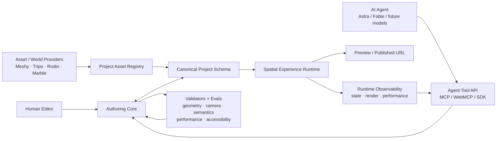
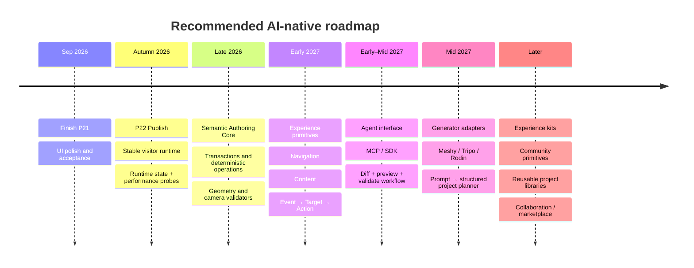

# AI-Native Spatial Authoring: SOTA, Moat, and Roadmap for `spatial-sketch-editor`

> **Status note (2026-09-06).** Research snapshot. External/SOTA findings
> remain reference evidence. Internal roadmap references reflect repository
> state at research time and are superseded by `docs/plans/README.md` and
> later owner decisions (notably the 2026-09-06 roadmap reconciliation:
> P23/P24 staged depth families, narrow P25 after useful minima, bounded
> agent/reuse proof after the first complete vertical slice).

## Executive summary

Big finding: **one-shot 3D already crossed important line.** Frontier agents can now take rough intent, operate Blender or Three.js tooling, build editable scenes, inspect renders, fix their own mistakes, stage cameras, and iterate toward usable output. OpenAI published a concrete GPT-6 Astra workflow on September 4, 2026 where Astra turned a design brief into an editable Blender architectural scene, created architecture, furniture, materials, lighting and cameras through Blender's Python API, inspected preview renders, repaired intersections/composition, then produced a multi-shot camera tour. This not theory now. citeturn12search0turn15view0

But important second finding: **the good results are not truly "one blind shot."** OpenAI's own architectural example used a floor-plan step, iterative render inspection, geometry repair, existing Poly Haven assets for a larger environment, explicit camera constraints and shot revision. Its game-building example used deterministic tests, named fixtures, browser instrumentation, render/state checks and performance counters. Playco's game workflow similarly gives agents direct Unity/Godot access so they can edit, run, test and validate rather than merely emit code. citeturn15view0turn15view1turn14view2

That distinction gives your project a real opening.

**Do not compete on "prompt → 3D."** Meshy, Tripo, Rodin, World Labs and future models make raw asset/world generation cheaper every month. Meshy already exposes Text-to-3D and an MCP server; Tripo exposes asset generation, texturing, rigging and conversion to agents; World Labs can create persistent explorable worlds from text, images and video. citeturn17search0turn17search1turn16search5turn17search2turn17search3

Compete on:

> **prompt → structured spatial project → reusable primitives → validated experience → durable runtime → publish**

Your current repo is much closer to that position than me expected. The GitHub URL was not supplied, but connected GitHub search found `toni8699/spatial-sketch-editor`; its terminology exactly matches this conversation, including Spatial/Experience, Camera Plan, P21–P25 and the AI-heavy-future statement, so me treat it as your repo. Its current north star already says AI and human authoring should act on the **same semantic project model**, with AI results remaining inspectable, editable, constrained, versionable and publishable. fileciteturn12file0L1-L27

Your repo also already made several strategically correct choices: one canonical asset ingest boundary; external generators/providers as replaceable boundaries; a Scene/Camera authoring split; camera graph + sequence as canonical spatial truth; an eventual `Event → Target → Action` experience model; project persistence; an asset registry; and a shared runtime rather than separate Spatial/Experience worlds. fileciteturn10file0L1-L2

So me would **not throw away north star**.

Me would sharpen it.

The durable product should become:

> **An agent-native spatial experience platform where humans and AI compose typed spatial, camera, content and interaction primitives instead of generating bespoke Three.js applications. Models and 3D generators are replaceable clients and suppliers. The durable layer is project schema + operations + validation + runtime.**

That is your Blender-like position.

Blender itself gives the analogy. Blender's value to an agent is not that AI cannot create geometry. AI now operates Blender through its Python API and official MCP work. Blender gives AI a mature object model, scene state, assets, operators, node systems, renderers and reusable node groups instead of forcing it to rebuild those systems. Blender Geometry Node groups act like reusable parameterized functions and can themselves become assets. citeturn13search0turn13search2turn11search2turn11search4turn11search8

**Your equivalent should be experience primitives.**

Not:

```text
AI
 ↓
write 8,000 lines of Three.js
 ↓
website
```

But:

```text
AI
 ↓
inspect_project
create_room
place_asset
create_view
connect_views
create_guided_sequence
bind_interaction
validate
publish
 ↓
your semantic project
 ↓
your runtime
 ↓
URL
```

That becomes cheaper as AI becomes smarter.

That is much closer to AI-proof.

## What SOTA can actually do now

As of September 5, 2026, frontier AI capability has moved beyond simple text-to-mesh. GPT-6 Astra is explicitly positioned around advanced coding and computer-use work, while Anthropic's Claude Fable 5.1 targets stronger coding and longer-running agent tasks. More important than vendor benchmark claims: both ecosystems now connect models directly to creative software rather than asking them merely to emit instructions. Anthropic documented Blender's official MCP integration for Claude, exposing Blender's Python API so the model can analyse scenes, make batch changes and build tooling inside Blender. citeturn12search0turn13search1turn13search0

**The strongest evidence for your exact problem is OpenAI's Astra architectural-visualization case.** The model receives a design brief, creates an editable Blender scene through the Python API, makes architecture, furniture, materials, lights and cameras, renders previews and corrects mistakes. It later builds a roughly 30-second camera walkthrough from four camera takes, using specified eye height, focal lengths, easing and gaze targets, then revises weak shots where framing lingered on blank walls or ended poorly. citeturn15view0

This matters because it kills one weak moat hypothesis:

> "Camera staging hard, so Camera Plan itself AI-proof."

No. AI can stage cameras already. citeturn15view0

Better moat:

> **Camera Plan turns generated camera intent into reusable, inspectable, editable and validated project state.**

That much stronger.

OpenAI's browser-based Modeling Studio pushes same direction. It was designed so Codex can inspect a running 3D scene and make object, model, material and composition changes through WebMCP. OpenAI says the system was designed primarily for Codex use, then improved by having Codex itself exercise the tool surface and expose limitations. This is unusually close to the product architecture you should adopt. citeturn14view1

OpenAI's game-building example gives another critical lesson. Its Three.js application exposed a debug API, named test scenes, state/performance counters and repeatable browser tests. The agent could reproduce a problem, inspect state, change implementation, rerun and compare. Deterministic generation, maths and contracts were covered with Vitest; browser behaviour used Playwright. citeturn15view1

Playco reports a similar pattern: an agent bridge directly connects frontier models to Unity or Godot, so models can modify scenes, run games and validate the result. Three themed prototypes were built from one common grey-box foundation rather than each being created from zero. That reuse pattern is strategically important for you: **give AI a tested foundation and let it mutate domain state, not regenerate infrastructure.** citeturn14view2

### Generation providers now look like infrastructure

The standalone 3D-generation layer is becoming a replaceable service layer.

| Tool / project | What agent can get | Maturity / terms | Integration into your product | Strategic use |
|---|---|---|---|---|
| **Meshy** | Text/image/multi-image → 3D, remesh, topology options, textures, rigging/animation and other asset operations; official MCP wraps API generation/status/download calls. citeturn17search0turn17search1turn17search19turn17search32 | Commercial production API | **Low–medium** | Great first provider behind your Asset Registry. Never make Meshy concepts project truth. |
| **Tripo** | Text/image → model plus texture, rig, animation and conversion; developer tooling is explicitly agent-oriented. citeturn16search5 | Commercial API | **Low–medium** | Good second provider to prove provider abstraction really works. |
| **Hyper3D Rodin** | Programmatic text/image-to-3D, generation/status/download and texture workflow. citeturn16search10turn16search14 | Commercial API | **Low** | Useful commodity asset source. |
| **World Labs Marble / World API** | Text/images/video/multiview → persistent explorable 3D worlds; editing, expansion, combination and downstream exports. citeturn17search2turn17search3turn17search6 | Commercial world-model/API layer | **Medium–high** | Treat generated world as environment/source asset. Do not make its representation your product model. |
| **Blender official MCP direction** | Frontier model can control Blender/Python scene operations and inspect/debug creative work. Raw generated code also creates security concerns; Blender explicitly warns about executing model-generated code. citeturn13search0turn13search2 | Official experimental workflow | **Reference, not dependency** | Shows what agent-native DCC looks like. Your API should be safer and more semantic than arbitrary Python. |
| **Three.js DevTools MCP** | Live inspection/modification of Three.js scenes with 59 tools spanning objects, materials, shaders, textures, animation, performance and memory; works across vanilla Three.js/R3F; MIT licence. fileciteturn18file0L1-L7 fileciteturn16file0L1-L6 | Community OSS, MIT | **Medium** | Excellent reference for observability/debug layer. Not enough alone as product moat. |
| **SAGE** | Agentic scene generation/refinement with generators and critics for scene quality/physical plausibility. Code is Apache-2.0. citeturn19search2turn19search10 fileciteturn21file0L1-L7 | Research + OSS | **Research reference** | Study critic/evaluator architecture more than scene generator itself. |
| **SceneAssistant** | Natural-language scene editing through atomic operations such as scaling/rotation/focus and visual feedback after operations. citeturn18search1 | Research repo; no root `LICENSE` found in my repo inspection | **Research reference** | Strong evidence for atomic-op + render-feedback architecture. |
| **WorldClaw** | Agentic large-world generation using structured planning and explicit scene assets intended for edit/reuse. Paper/repo released August 7, 2026. citeturn19search1 fileciteturn23file0L1-L7 | Very recent research | **Research reference** | Important because it converges on structured scene specification rather than opaque final pixels. |

Meshy's own API structure is revealing: its Text-to-3D process separates geometry preview from later refinement rather than pretending a single generation pass is always final. That is exactly how your product should think about agent work: **draft state → inspect → validate → refine → accept.** citeturn17search0

World Labs is the bigger strategic threat to a basic spatial editor. Marble can create persistent 3D worlds from sparse input, while its Chisel workflow provides coarse geometric world blocking and later refinement. World Labs also describes staged create/edit workflows rather than one final opaque generation call. citeturn17search3turn17search25turn17search31

So raw proposition:

> "Come manually build a 3D room on web."

gets weaker.

But proposition:

> "Turn any generated world/assets into a controllable, semantic, interactive, tested and publishable experience."

gets stronger.

### Research is converging on the same architecture

Recent research gives surprisingly consistent signal.

**SceneAssistant** combines language/VLM reasoning, atomic scene operations and rendered visual feedback after steps. citeturn18search1

**NaLA** gives a 3D layout agent actual geometric context so it can reason about collision, support and containment, rather than expecting language alone to understand exact spatial relationships. citeturn18search3

**SAGE** separates generation from critics that evaluate semantic plausibility, visual realism and physical stability, then iteratively improves results. citeturn19search2turn19search10

**Scenethesis** likewise combines a coarse semantic plan, visual refinement and explicit optimisation toward physically plausible arrangements rather than relying on a single forward generation pass. citeturn18search0

**SceneOrchestra** pushes further: once a reliable tool vocabulary exists, an orchestration model can predict sequences of scene-tool calls rather than generating implementation code. citeturn19search0

**WorldClaw** uses planning agents to turn user intent into structured regions, terrain, assets, materials and spatial relationships, with explicit assets retained for downstream editing/reuse. citeturn19search1

That convergence is biggest research signal in this report:

> **SOTA scene agents increasingly want structured state + tools + spatial facts + critics.**

That is almost exactly product layer you can build.

A recent benchmark also gives reason not to believe every flashy one-shot demo. VibeWorlding reports substantial failure rates for current models/scaffolds on more demanding world-building tasks. The exact benchmark may evolve quickly, but direction matters: public hero demos and production reliability remain different things. citeturn18search12

### X, Reddit and YouTube show same practical split

X has many impressive Astra/Blender demonstrations: one-post examples claim whole Blender scenes from a single concept/reference prompt, including environments and walkable or camera-staged scenes. These useful as capability discovery, but they are cherry-picked social demonstrations, not controlled benchmarks. citeturn20search0turn20search3turn20search6turn20search9

Another useful X pattern comes from AI filmmaking/previs: creators are using Blender blocking and camera moves as stable structure before downstream generative video. That suggests camera plans, staging and semantic scene state may become **control inputs to generative media**, not features made obsolete by it. citeturn20search11turn20search12

Reddit discussion is more sceptical and therefore useful. In an r/aigamedev thread about letting agents operate Blender tools rather than simply using text-to-mesh, users focus on editable geometry, UVs, scene state and spatial reasoning; commenters also report that generic agents often need custom tooling to become reliable. citeturn20search1

An r/aifilmmaking workflow discussion describes writing the scene, blocking it in Blender, locking camera/props/movement, rendering references, then handing those stable references to generative video. Again, structure first, stochastic generation second. citeturn20search7

A separate Claude/Blender MCP discussion reports better results after changing the MCP/tooling layer itself, which reinforces that **agent performance depends heavily on quality of tool contract, not only base model IQ.** That is anecdotal evidence, but strategically relevant. citeturn20search18

## What AI should reuse instead of rebuild

This part most important.

Your product should expose a **small semantic language for spatial experiences**.

Do not expose Svelte.

Do not expose Three.js object internals as primary API.

Do not tell agent to modify raw project JSON.

Do not make `executeJavaScript()` or `executePython()` main tool.

Those become escape hatches.

Main interface should be deterministic project operations.

### Reusable data primitives

Your current north star already contains much of needed IR. It has Scene/Camera over Plan/3D, a project-level Asset Registry, camera graph/sequence semantics and future Experience concepts based around Navigation, Content and `Event → Target → Action`. fileciteturn10file0L1-L2

Me would formalize durable primitive set like:

```text
Project
├── Spatial
│   ├── Layout
│   │   ├── Room
│   │   ├── Wall
│   │   ├── Opening
│   │   ├── Surface
│   │   └── Level
│   │
│   ├── Scene
│   │   ├── Entity
│   │   ├── AssetRef
│   │   ├── Material
│   │   ├── Light
│   │   └── Environment
│   │
│   └── Direction
│       ├── View
│       ├── Connection
│       ├── Path
│       ├── Sequence
│       ├── ShotIntent
│       ├── AttentionBeat
│       └── Cue
│
├── Experience
│   ├── Destination
│   ├── NavigationItem
│   ├── Content
│   ├── Interaction
│   └── VisitorPolicy
│
├── Assets
│   └── AssetRecord
│
└── Runtime
    └── PublishConfig
```

This does not fight current repo design. It mostly makes current destination more explicit as an **intermediate representation for both human and agent clients**. Your existing north star already says Experience must reference Spatial rather than duplicate scene/camera truth, which is exactly right for this architecture. fileciteturn10file0L1-L2

### Reusable deterministic operations

This is where moat can become real.

| Domain | Agent operations worth making first |
|---|---|
| **Inspect** | `inspect_project`, `query_entities`, `inspect_entity`, `get_bounds`, `get_spatial_relations`, `get_camera_plan`, `get_runtime_stats` |
| **Layout** | `create_room`, `resize_room`, `add_wall`, `add_opening`, `set_surface`, `duplicate_structure` |
| **Scene** | `place_asset`, `set_transform`, `align`, `distribute`, `attach`, `group`, `lock`, `set_visibility`, `set_material`, `set_light` |
| **Assets** | `search_assets`, `generate_asset`, `ingest_asset`, `normalize_asset`, `replace_asset`, `create_lod`, `inspect_license` |
| **Camera** | `create_view`, `set_pose`, `set_target`, `set_lens`, `connect_views`, `set_path`, `set_duration`, `set_sequence`, `set_attention_subject` |
| **Experience** | `create_destination`, `add_navigation_item`, `create_content`, `bind_interaction`, `set_visitor_policy`, `attach_audio` |
| **Quality** | `validate_project`, `validate_layout`, `validate_camera_plan`, `validate_performance`, `render_preview`, `compare_preview` |
| **State** | `begin_transaction`, `preview_diff`, `commit`, `rollback`, `undo`, `redo`, `snapshot`, `restore_version` |
| **Delivery** | `preview_experience`, `publish`, `inspect_publish`, `unpublish` |

Every write should ideally return something like:

```ts
type OperationResult<T> = {
  projectVersion: string;
  transactionId: string;
  affectedIds: string[];
  result: T;
  warnings: ValidationIssue[];
  errors: ValidationIssue[];
};
```

And every destructive operation should support preconditions:

```ts
moveEntity({
  id: "sculpture-12",
  position: [4.2, 0, 8.1],
  expectedVersion: "v_147",
  constraints: {
    preserveFloorContact: true,
    avoidCollision: true
  }
});
```

That gives agents something raw Blender Python does not: **bounded semantics**.

Blender's own MCP page warns that generated code can execute without normal safety guards. That raw power fine for creative experimentation. For hosted user projects, your advantage should be more controlled: typed commands, ownership checks, validation, transactions and reversible diffs. citeturn13search2

### Geometry facts should be tools too

Do not force model to infer spatial truth from screenshots or giant JSON dumps.

NaLA and related scene-generation work show why agents improve when they receive geometric context for collision, containment and support. citeturn18search3turn19search24

Give tools like:

```text
get_world_bounds(entity)
get_distance(a, b)
get_support_surface(entity)
get_visibility(camera, subject)
get_occlusion(camera, subject)
get_clearance(entity)
get_path_clearance(connection)
get_room_membership(entity)
get_nearest_surface(point)
```

Then model can reason:

```text
"Put sculpture near east wall,
 but leave 1.5 m visitor clearance."
```

without mentally calculating all geometry.

### Camera Plan should become a reusable direction grammar

This may be your strongest differentiated primitive set.

Your repo already treats camera graph as topology, sequence as primary guided traversal, and future direction semantics as `View / Shot → Transition → Attention Beat → Cue → optional Branch`. That is much more useful to agents than an array of keyframes. fileciteturn10file0L1-L2

Make camera intent explicitly reusable:

```ts
type ShotIntent =
  | "establish"
  | "approach"
  | "reveal"
  | "inspect"
  | "orbit"
  | "follow"
  | "rest"
  | "exit";

type Shot = {
  subjectIds: EntityId[];
  intent: ShotIntent;
  durationRange?: [number, number];
  lensRange?: [number, number];
  eyeHeight?: number;
  minSubjectCoverage?: number;
  maxOcclusion?: number;
  motionProfile?: MotionProfile;
  attention?: AttentionBeat[];
  cues?: Cue[];
};
```

Then user asks:

> "Slow reveal of piano. Start wide from doorway. Approach for four seconds. Stop with piano filling about half frame. Then orbit left and reveal portrait."

AI builds a **camera program**, not animation code.

Human sees it in Camera Plan.

Human moves node.

Runtime resolves it.

Validator checks it.

Experience content can bind to cue.

That is far stronger than "AI generated camera spline."

OpenAI's Astra example already shows AI can invent eye height, lens values, easing, shot ordering and gaze targets; therefore your long-run leverage comes from making those choices persistent semantic objects that can be reused and modified. citeturn15view0

### Reusable higher-level experience kits

After primitives work, add composition.

Think Blender Node Group.

Not giant template.

Small semantic bundle.

```text
Hero Reveal
├─ establish view
├─ approach transition
├─ subject visibility constraint
├─ reveal cue
└─ optional title interaction
```

```text
Museum Stop
├─ destination
├─ inspection view
├─ info card
├─ next/previous navigation
└─ reduced-motion fallback
```

```text
Product Orbit
├─ hero view
├─ constrained orbit
├─ hotspot set
├─ CTA content
└─ mobile fallback
```

```text
Guided Gallery Tour
├─ entrance
├─ ordered destinations
├─ camera sequence
├─ narration cues
└─ free-explore escape
```

Model can then call:

```text
instantiate("product-orbit", subject="car")
```

and modify five parameters.

This compresses model work dramatically.

That is same basic value proposition of reusable Geometry Node groups: parameterized logic survives across projects instead of being recreated every time. citeturn11search2turn11search4turn11search6

## Gap and opportunity for your current project

Your repo north star already gets several things right. It says generic mesh supply is not moat; all external asset sources should converge through one canonical asset boundary; generator identity remains replaceable metadata rather than core project truth. It also says AI-assisted work should resolve into normal inspectable project state rather than a second AI-only state. fileciteturn10file0L1-L2

Your current roadmap is also at unusually good transition point. P19 persistence shipped September 3; P20 project asset registry/R2 shipped September 4; P21 project shell/UI reconciliation is in progress with P21.5/final acceptance remaining. Current direction then puts P22 on basic Publish + visitor runtime, P23 on typed database access, P24 on Experience foundation, and P25+ on expansion. fileciteturn11file0L1-L10

That means you already built much boring infrastructure needed before agent layer makes sense.

### What is already a strategic asset

| Existing work | AI-era value |
|---|---|
| **Portable project truth** | AI operates durable model rather than source code. |
| **Scene / Camera ownership split** | Clear tool authority. Agent knows which domain owns what. |
| **Plan / 3D views** | Same state can be manipulated abstractly and inspected visually. |
| **Camera graph + sequence** | Ready-made semantic program for direction/navigation. |
| **Camera timeline/framing work** | Can become reusable shot grammar. |
| **Project persistence/version concepts** | Agent mutations can become transactions/versions. |
| **Project Asset Registry** | Perfect boundary for Meshy/Tripo/Rodin/etc. |
| **Single geometry compiler** | AI can author semantic architecture without generating mesh code. |
| **Visitor runtime direction** | AI output becomes product, not editor file. |
| **Future `Event → Target → Action` model** | Excellent compact tool vocabulary for agent-created interactions. |

The repository has real implementation behind the camera architecture: current editor source imports camera timeline/flow logic, and project contracts explicitly reference an extracted camera core. fileciteturn17file5L102-L113 fileciteturn17file8L163-L174

### What is still missing

Biggest missing thing is not another generator.

It is a **public semantic operation boundary**.

Right now editor itself appears to be main privileged client of project state. AI-native architecture wants:

```text
Editor UI ─┐
           │
Agent ─────┼──> Authoring Core ──> Canonical Project
           │
SDK ───────┘
```

not:

```text
Editor UI ──> editor store internals
Agent ──────> generated source code / raw JSON hacks
```

Second missing thing is **evaluation as product primitive**.

Your current tests already show strong engineering culture, and P21 closeout includes Vitest/check/build/bundle and visual/accessibility gates. fileciteturn11file0L1-L10

Turn same philosophy outward.

User projects need runtime validators too.

Agent needs answer to:

> "Did me make good experience?"

not merely:

> "Did schema parse?"

This is exactly what current research critics and OpenAI's instrumented agent workflows point toward. citeturn19search2turn18search0turn15view1

Third gap is **agent observability**.

Three.js DevTools MCP exposes scene tree, live performance, materials and diagnostics to the model. OpenAI's game example exposed named test scenes and state/performance probes. Your runtime should expose similar domain-level observability but with your richer semantics. fileciteturn18file0L1-L7 citeturn15view1

Fourth gap is **reusable compositions**.

Assets alone not enough.

A car GLB reusable.

But more valuable:

```text
car-launch-showroom
car-hero-reveal
car-orbit
feature-hotspot
guided-product-tour
```

Those encode work above mesh layer.

### Where moat should sit

Me rank long-run moat:

| Layer | Moat potential | Why |
|---|---:|---|
| Raw text-to-3D | ★ | Rapid commodity/API layer. citeturn17search0turn16search5 |
| Raw Three.js generation | ★ | Frontier coding agents increasingly capable. citeturn12search0turn14view1 |
| Generic transform editor | ★★ | Mature DCC/web tooling already owns it. |
| Asset ingest/provenance/normalization | ★★★ | Needed, durable infrastructure. |
| Semantic project schema | ★★★★★ | Stable language models can target. |
| Deterministic operation protocol | ★★★★★ | Makes models cheaper, safer, reliable and interchangeable. |
| Camera/direction grammar | ★★★★★ | Domain-specific reusable intent above keyframes. |
| Experience primitives | ★★★★★ | Converts 3D world into actual visitor product. |
| Validators/evals | ★★★★★ | Generation gets cheap; deciding "works" gets valuable. |
| Spatial runtime/publishing | ★★★★★ | Gives all generated state durable execution target. |
| Reusable experience kits | ★★★★★ | Compounds across users/projects/models. |

This is my core inference from evidence above: **as generative capability rises, value moves from creation toward representation, orchestration, validation and execution.** The primary-source workflows from OpenAI, Blender and current scene-generation research all point that way. citeturn15view0turn15view1turn13search0turn18search1turn19search2

Architecture should move toward:



Critical rule:

> **Editor and AI are clients of same Authoring Core. Neither owns truth.**

And:

> **Provider outputs enter through Asset Registry. Provider never becomes project architecture.**

That fits your existing north star rather than fighting it. fileciteturn12file0L8-L27

## North-star amendment

Your current AI paragraph is good. Keep it. It already says human and agent authoring share one semantic project model. fileciteturn12file0L8-L27

But it is defensive:

> product should remain useful in AI-heavy future.

Me would make it offensive.

Add something like this to `docs/north-star.md`:

> **Agent-native authoring**
>
> Museum Editor is a web-native authoring system and runtime for spatial experiences, usable by humans and software agents through the same semantic project model.
>
> A creator may describe an experience at a high level and allow an agent to assemble or revise it using typed spatial, asset, camera, content and interaction primitives. Agents do not need to regenerate a bespoke Three.js application, duplicate editor state, or treat generated source code as project truth.
>
> The durable product boundary is the canonical project representation, deterministic authoring operations, reusable experience primitives, validation system and spatial runtime. Foundation models, asset generators, world generators and external DCC tools are replaceable clients or suppliers around that boundary.
>
> Assisted work must resolve into the same inspectable, editable, constrained, versioned and publishable state as manual work. Every agent mutation should be attributable, reversible and independently validatable.
>
> The long-term product loop therefore becomes:
>
> `Describe → Plan → Compose → Direct → Validate → Preview → Publish → Refine`
>
> The platform succeeds when an agent prefers composing a tested Museum Editor project over generating equivalent rendering, navigation, camera, interaction and publishing infrastructure from scratch.

Then add one hard architecture rule:

```text
AI never owns parallel truth.

Human UI
Agent API
Automation
Importers

        ↓

same deterministic authoring operations

        ↓

same project documents

        ↓

same validation

        ↓

same runtime
```

And one product principle:

> **When AI repeatedly generates same logic, turn that logic into a reusable primitive.**

Examples:

```text
AI keeps writing orbit-camera code
→ Product Orbit primitive

AI keeps writing hotspot event handlers
→ Hotspot + Interaction primitives

AI keeps rebuilding gallery navigation
→ Guided Tour primitive

AI keeps writing room geometry
→ semantic room/layout operations

AI keeps creating loading/LOD logic
→ runtime responsibility

AI keeps coding scene validators
→ validator API

AI keeps recreating asset normalization
→ ingest pipeline
```

That is how system gains more value each year.

### The target user experience

This should become your test prompt:

> **"Build me a brutalist virtual car launch. Large concrete atrium at dusk. Black sports coupe on a low rotating plinth. Start with 8-second establishing approach, then hero reveal, slow left orbit, close inspection, then wide finish. Add four product hotspots, ambient sound, short feature cards, free-explore after guided tour. Must work on mobile and keep initial payload under project performance budget."**

Ideal agent work:

```text
1. create_project("car-launch")

2. instantiate_layout("brutalist-atrium")
   or create semantic room/walls/openings

3. search/generate car + furniture assets

4. ingest assets through registry
   → normalize pivot
   → scale
   → provenance
   → optimization metadata

5. stage scene
   → plinth
   → car
   → lights
   → environment

6. build Camera Plan
   → establish
   → approach
   → reveal
   → orbit
   → inspect
   → finish

7. author Experience
   → navigation
   → four content cards
   → hotspot interactions
   → audio
   → free-explore transition

8. validate
   → collisions
   → clearances
   → subject visibility
   → camera clipping
   → path continuity
   → performance
   → missing assets
   → accessibility / reduced-motion

9. preview

10. repair failed constraints

11. publish
```

Zero bespoke application code needed for normal case.

That is killer benchmark.

Compare two agents:

**Baseline**

```text
Prompt
→ model writes Vite
→ installs Three.js
→ invents loaders
→ writes camera controller
→ writes interactions
→ writes responsive UI
→ writes asset paths
→ debugs runtime
→ deploys app
```

**Your platform**

```text
Prompt
→ 25–60 semantic tool calls
→ validated ProjectDocument
→ runtime
→ URL
```

The stronger models become, the better second system gets.

## Prioritized roadmap

Me would **finish P21. Do not derail current closeout.** P21.5 + acceptance gives clean baseline. Current tracker explicitly has that as next gate before P22. fileciteturn11file0L1-L10

Then preserve P22 because Publish/runtime is strategically essential.

Me would, however, amend what "runtime" means.

It should not merely display published scene.

P22 should establish first **stable execution contract** that future agents target.

### Proposed sequence

| Work | Priority | Rough solo effort | What to ship | Why now |
|---|---:|---:|---|---|
| **Finish P21** | P0 | Current remaining slice | P21.5 + current acceptance gates | Clean UX/platform baseline. Current tracker already requires this. fileciteturn11file0L1-L10 |
| **P22 Publish + Spatial Runtime Contract** | P0 | 5–8 weeks | Versioned published snapshot, deterministic asset resolution, visitor runtime, runtime diagnostics, stable preview fixture API | Gives every future agent project an execution target. |
| **Semantic Authoring Operations** | P0 | 6–10 weeks | UI-independent command layer for Scene/Layout/Camera/Assets with transactions, preconditions, diffs, undo | Most important AI platform investment. |
| **Validator + Observability Core** | P0 | 4–7 weeks | Spatial facts, collisions, refs, camera visibility/clipping, route integrity, perf counters, screenshots/state probes | Lets model close its own loop; supported by SOTA workflows. citeturn15view1turn19search2 |
| **Experience Primitive Foundation** | P0/P1 | 5–8 weeks | Destination, NavigationItem, Content, Interaction and VisitorPolicy documents | Turns scene into reusable experience rather than rendered world. |
| **Direction / Camera Primitive Kit** | P1 | 4–6 weeks | ShotIntent, AttentionBeat, Cue, templates, camera validators | Makes your strongest existing domain agent-friendly. |
| **Agent API** | P1 | 4–7 weeks | MCP first; optional WebMCP/TS SDK; inspect → mutate → preview → validate → publish | Models can finally use platform directly. |
| **Provider Adapters** | P1 | 2–4 weeks each | Meshy first, then Tripo/Rodin; World Labs later | Commodity generation feeds your durable asset boundary. citeturn17search1turn16search5 |
| **Prompt → Project Planner** | P1 | 5–8 weeks | Intent decomposition → plan → operations → validate/refine loop | This gives user one-shot experience without making one-shot generation your architecture. |
| **Experience Kits / Templates** | P2 | 5–10 weeks ongoing | Product reveal, museum stop, guided tour, gallery, spatial portfolio, showroom | Reuse compounds; reduces agent calls and tokens. |
| **Collaboration / marketplace / billing** | P3 | Later | Team and commercial systems | Useful after creation/runtime loop proves demand. |

Effort ranges are planning estimates, not repo measurements. They assume one experienced developer using current codebase rather than greenfield work.

Your existing P23 typed-DB direction is valid plumbing, but me would **keep it narrow**. Current roadmap deliberately schedules it after P22. Do not let typed DB redesign consume months while this strategic agent boundary remains absent. fileciteturn11file0L1-L10

Because your tracker has explicit P-number rules, me would not casually renumber current P23/P24 in docs. Better amendment:

```text
P21   finish product shell
P22   publish + runtime contract
P23   typed DB, tightly bounded

P24   Experience foundation
      + define semantic primitive contracts

P25   Authoring Core / operation protocol

P26   Agent interface + validators

P27   Provider adapters + Prompt-to-Project

P28+  reusable kits, sharing, teams, marketplace
```

But me see one dependency problem: **agent-safe operations ideally start before full Experience mode.**

So best engineering move: do design/extraction work for Authoring Core during P22/P24 without exposing an AI feature yet. Then MCP becomes thin client later.

Timeline:



### Validation should become explicit product benchmark

Do not measure AI feature by:

> "Wow, it built pretty room."

Create fixed benchmark suite.

Say 30 prompts:

```text
museum gallery
product showroom
architectural tour
portfolio
history walkthrough
education room
interactive sculpture
car launch
fashion exhibition
small narrative world
```

For each prompt, score:

| Metric | Initial target |
|---|---:|
| Project decodes with zero schema errors | **100%** |
| Tool command execution success, excluding upstream provider outage | **≥99%** |
| All agent mutations represented as reversible transactions | **100%** |
| Broken asset/entity references after final validation | **0** |
| Camera topology/sequence invalid edges | **0** |
| Hard camera/geometry collision after validation | **0** |
| Required subject visible for intended shot samples | **≥95%** |
| Published benchmark project loads without runtime error | **100%** |
| Agent mutations with exact affected IDs + before/after diff | **100%** |
| Standard experience requiring generated application JS | **0% target** |
| Prompt revision changes only intended state rather than rebuilding project | **>90% benchmark cases** |
| Reuse rate from primitives/templates | Track upward; aim **>60%** for standard cases |
| Agent token/tool cost versus greenfield Three.js baseline | Measure; target **3–10× lower total model work** |

The last targets are product goals, not claims about current performance.

Also measure **regeneration blast radius**.

Prompt:

> "Keep everything. Make tour slower and move sculpture 1 metre left."

Bad system regenerates scene.

Good system yields:

```text
set_transition_duration(...)
set_transform(sculpture, ...)
```

Two operations.

That may become one of best demonstrations of moat.

### Agent transaction UX

Do not add generic chatbot and stop.

Better:

```text
You: Make gallery more dramatic.

Agent proposes:

Scene
  ~ GalleryKeyLight intensity 2.0 → 3.3
  + RimLight
  ~ Wall material roughness 0.72 → 0.60

Camera
  ~ PianoReveal lens 35mm → 42mm
  ~ PianoReveal target → Piano

Experience
  no changes

Validation
  ✓ no camera collision
  ✓ target visible
  ✓ budget within limit

[Apply] [Review individually]
```

This is human + AI authoring.

Not vibe coding.

That workflow follows your repo's current promise that AI output remain inspectable/editable/constrained rather than creating parallel opaque state. fileciteturn12file0L8-L27

## Watchlist and research sources

Me would follow **workflows**, not hype around single model.

Model names change fast.

Architecture patterns last.

### GitHub projects worth tracking

**`DmitriyGolub/threejs-devtools-mcp`** — perhaps most immediately useful architecture reference for you. It exposes 59 live Three.js inspection/modification/diagnostic tools and explicitly documents token-efficient workflows. MIT. Study tool granularity, scene discovery, perf exposure and model-facing responses. fileciteturn18file0L1-L7

**`ahujasid/blender-mcp`** — important historical/community reference for how rapidly direct Blender-agent control spread before/alongside official Blender MCP work. Compare its broad Python-oriented power with the narrower semantic API you should expose. Blender's own official MCP work now makes the underlying pattern mainstream. citeturn13search0turn13search2

**`ROUJINN/SceneAssistant`** — track atomic scene operations + visual-feedback loop. citeturn18search1

**`NVlabs/sage`** — study generator/critic architecture and evaluation. Repo carries Apache-2.0. citeturn19search2 fileciteturn21file0L1-L7

**`Tencent-Hunyuan/Hunyuan3D-WorldClaw`** — released August 7, 2026; track structured planning for very large scenes/worlds and explicit reusable assets. fileciteturn23file0L1-L7

**Awesome 3D Scene Generation lists** are useful for tracking the research flood across text-to-scene, layout, physically grounded staging and world generation rather than finding papers one at a time. citeturn18search17

Also track World Labs' open web-rendering work around Spark because Gaussian-splat/world representations may become another asset/environment format your runtime eventually needs to consume rather than replace. World Labs already positions Spark as a way to integrate Gaussian splats into Three.js/web experiences. citeturn17search17turn17search33

### Papers/projects me would keep close

| Project | Why it matters to your architecture |
|---|---|
| **SceneAssistant** | Atomic ops + render feedback. citeturn18search1 |
| **NaLA** | Agents need geometry-aware context for support/collision/containment. citeturn18search3 |
| **SAGE** | Critics/validators as first-class components. citeturn19search2 |
| **Scenethesis** | Semantic plan + physical optimisation rather than blind generation. citeturn18search0 |
| **SceneOrchestra** | Tool-call trajectories can replace source-code generation once tool vocabulary good. citeturn19search0 |
| **WorldClaw** | Prompt → structured world spec with editable/reusable explicit assets. citeturn19search1 |
| **VibeWorlding** | Useful counterweight to hero demos; test reliability, not screenshots. citeturn18search12 |

### X accounts and threads

Use X mostly to spot workflows before formal docs appear.

Watch **@anshuc** for Astra/Blender MCP experimentation; the account posted a concept-to-Blender one-shot demonstration using Codex/Blender tooling. Treat timing/quality claims as anecdotal. citeturn20search0

Watch **@andrewpprice** for Blender/AI workflow commentary. His recent discussion directly touches the question of whether AI replaces 3D software versus using mature 3D software as staging/scene infrastructure. citeturn20search2

Watch **@higgsfield_ai** and creators around it for the emerging **3D previs → generative video** workflow, especially camera blocking/storyboarding versus final generated footage. citeturn20search11turn20search12

Also useful are builders posting direct Blender agent experiments such as the environment/character and scene examples surfaced in this search. They show capability frontier but should not be treated as reliability benchmarks. citeturn20search3turn20search6turn20search9turn20search14

### Reddit threads worth watching

r/aigamedev: **AI agents controlling Blender modelling tools instead of text-to-mesh.** Good discussion because users ask about editable state, clean geometry, scene statistics, spatial reasoning and custom tooling rather than only visual quality. citeturn20search1

r/aifilmmaking: **Blender blockout + AI video workflow.** Especially relevant to your Camera Plan because creators use stable cameras, prop locations and blocking as deterministic control over stochastic generation. citeturn20search7

r/ClaudeAI: Blender MCP/tooling threads. Good place to see where default MCP abstractions fail and custom tool design improves results. citeturn20search18

r/blender AI discussions are useful counter-signal because experienced users frequently focus on correction cost, topology, predictability and whether an AI workflow actually saves time rather than whether one screenshot looks good. citeturn20search10

### YouTube worth monitoring

**Aidan Stanik — “I Tested GPT-6 Astra In Blender.”** Useful hands-on frontier check rather than vendor launch copy. citeturn21search1

**Building Aeon — “Can Claude Fable Make AI Assets Game Ready?”** Especially relevant because it examines what happens *after* generation, including very heavy/generated meshes and Blender-assisted cleanup. That production gap is where your canonical ingest/normalization pipeline can matter. citeturn21search3

Look for long-form **Blender MCP + Claude** build/tutorial videos rather than only short demos. Current examples show full-session scene/game building and expose where models need corrections and structured tools. citeturn21search7turn21search11

OpenAI's official/developer Astra examples deserve watching because architectural visualisation and game building now directly overlap your domain and show the agent testing patterns likely to become normal. citeturn15view0turn15view1

### Search queries me would keep saved

Run these every few weeks:

```text
"agentic 3D scene generation" tool calling
"editable 3D scene" LLM agent
"3D scene agent" MCP
"Three.js MCP" scene inspector
"WebMCP" Three.js
"Blender MCP" camera staging
"Blender MCP" scene generation
"AI previs" Blender camera
"AI video" Blender blockout camera
"camera blocking" generative video
"camera planning" multimodal agent
"3D layout agent" collision support containment
"scene graph" LLM spatial reasoning
"geometry-aware agent" 3D scene
"physical critic" 3D scene generation
"semantic 3D authoring" AI
"agentic spatial authoring"
"prompt to interactive 3D experience"
"prompt to Three.js world"
"spatial runtime" agent
"3D authoring schema" agent
"reusable scene primitives" AI
"text to world" editable objects
"world model" semantic objects editor
"AI 3D asset pipeline" retopology LOD
"3D agent validation" collision occlusion
"AI camera director" 3D
"previs agent" 3D
```

And provider-specific:

```text
Meshy MCP agent
Meshy API scene pipeline
Tripo MCP agent
Tripo CLI agent
Rodin API agent
World Labs API editable worlds
Marble Chisel scene
Gaussian splat Three.js Spark
Hunyuan WorldClaw
SceneAssistant 3D agent
SAGE scene generation
SceneOrchestra tool calling
NaLA 3D layout
```

The broad thing to watch is not whether next model can make prettier room.

Assume it can.

Watch whether models increasingly prefer:

```text
structured scene spec
+
stable reusable tools
+
geometry queries
+
visual/state feedback
+
validators
+
runtime
```

Current evidence says yes. citeturn15view0turn15view1turn18search1turn18search3turn19search0turn19search2

That makes your best strategic position much clearer:

> **Do not build another AI 3D generator.**
>
> **Build place where AI-generated 3D becomes a real project.**

Or in Blender analogy:

> Blender gives agents reusable language for making and manipulating 3D.
>
> **Your platform should give agents reusable language for turning 3D into an experience.**

The future call should not be:

```text
"GPT, write me a 3D site."
```

It should become:

```text
"Build me a spatial product launch."

Agent:
→ uses your layout primitives
→ pulls/generates assets
→ uses your staging primitives
→ writes Camera Plan
→ composes Experience
→ runs your validators
→ fixes failures
→ publishes through your runtime
```

AI supplies intelligence.

Providers supply meshes/worlds.

**You supply structure, operations, reuse, constraints, evaluation and execution.**

That is strongest amendment to current north star.